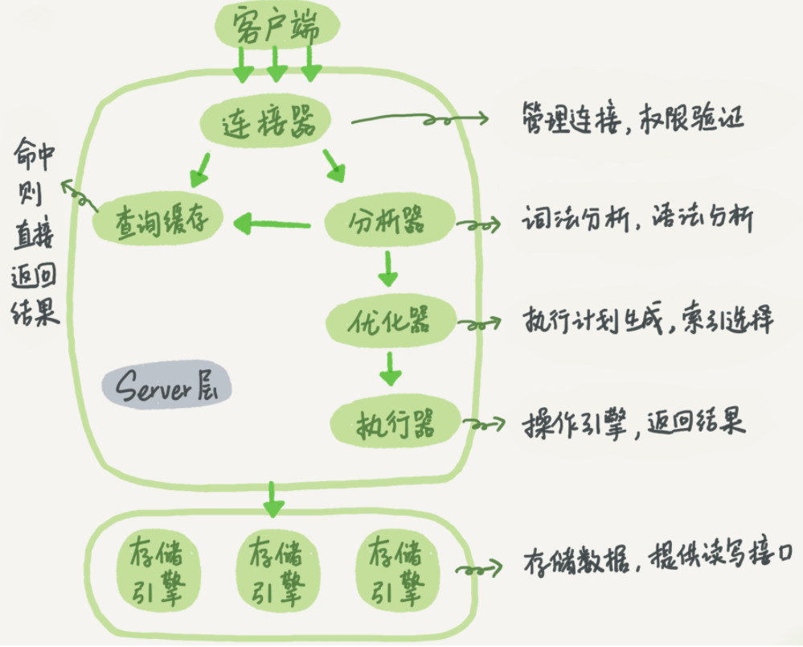

# 1. 一条 SQL 语句的执行

通过连接器建立连接，查询缓存判断之前有没有干过，通过分析器判断要做什么，通过优化器确定执行顺序，最后通过执行器来执行具体计划。

1. 连接器
   1. 客户端默认超过 8h 不做操作就会断开。
   2. 长连接是一直用同一个连接。短连接是指用一次连一次。建议使用长连接，减少开销。
   3. 如果都使用长连接也会导致很大的开销进而导致占用内存太大被系统强行杀掉。
      1. 定期断开长连接。
      2. MySQL5.7 以后使用 mysql_reset_connection 来重新初始化连接资源，不需要重连和重新做权限验证，但是会将连接恢复到刚刚创建完时的状态。
2. 查询缓存：判断之前有没有做过类似的操作。
   1. 一旦出现表被修改，所有缓存都将失效。
   2. MySQL 8.0 以后将所有查询缓存功能删掉了。
3. 分析器：要做什么
   1. 词法分析
   2. 语法分析
4. 优化器：怎么做
   1. 一个表有多个索引选择使用最优的索引。
   2. 多表关联的时候选择最优的顺序。
5. 执行器：干活！
   1. 遍历表的每一行，将符合条件的返回。

# 2. redo log

当发送更新的时候，InnoDB 引擎就会先把记录写到 redo log 中，然后在适当(空闲)的时候写入磁盘。这个技术被称为 WAL ，全称是 Write-Ahead Logging 先写日志，再写磁盘。

如果 redo log 写满的话就从头开始继续写。

write pos是当前记录的位置，checkpoint 表示当前要擦除的位置。

当 write pos 追上 checkpoint 时表示写满。此时需要 checkpoint 向后推进，写入磁盘中。

通过 redo log 实现了数据库发生异常重启的话之前的提交记录不会丢失，所谓 crash-safe 。

# 3. binlog

redo log 是 InnoDB 引擎特有的日志。

Server 层也有自己的日志，称为 binlog（归档日志）。

在此之前 MySQL 的自带的引擎是 MyISAM 但是这个引擎没有 crash-safe 功能，只依赖 binlog 无法实现，而 InnoDB 是另一个公司以插件形式引入MySQL的。所以 InnoDB 单独实现了一个 redo log 来实现 crash-safe。

1. binlog 是在 MySQL 的 server 层实现的，所有引擎都可用。而 redo log 是 InnoDB 特有的。

2. redo log是物理日志，记录的是“在某个数据页上做了什么修改”；binlog是逻辑日志，记录的是这个语句的原始逻辑，比如“给ID=2这一行的c字段加1 ”。
3. redo log是循环写的，空间固定会用完；binlog是可以追加写入的。“追加写”是指binlog文件写到一定大小后会切换到下一个，并不会覆盖以前的日志。

redo是物理的，binlog是逻辑的；现在由于redo是属于InnoDB引擎，所以必须要有binlog，因为你可以使用别的引擎

# 4. 两阶段提交

提交的时候等待 binlog 写入磁盘完成后提交 redo log 。目的是维护两种日志的一致性。

否则反过来如果先写 redo log 再写 binlog ，中间一旦发生崩溃，恢复后 redo log 和 binlog 的信息就不一致了。

# 5. 事务

事务就是要保证一组数据库操作，要么全部成功，要么全部失败。

事务是在引擎层实现的。MyISAM 不支持事务。

事务的 ACID （Atomicity、Consistency、Isolation、Durability，即原子性、一致性、隔离性、持久性）四个特性。

# 6. 事务的隔离级别

事务的隔离级别是为了解决脏读（dirty read）、不可重复读（non-repeatable read）、幻读（phantom read）的问题。

隔离的越彻底效率越低，所以需要一个平衡。

1. 读未提交是指，一个事务还没提交时，它做的变更就能被别的事务看到。
2. 读提交是指，一个事务提交之后，它做的变更才会被其他事务看到。
3. 可重复读是指，一个事务执行过程中看到的数据，总是跟这个事务在启动时看到的数据是一致的。当然在可重复读隔离级别下，未提交变更对其他事务也是不可见的。
4. 串行化，顾名思义是对于同一行记录，“写”会加“写锁”，“读”会加“读锁”。当出现读写锁冲突的时候，后访问的事务必须等前一个事务执行完成，才能继续执行。

# 7. 索引

索引是为了加快查询速度。

主键索引的叶子节点存的是整行数据。在InnoDB里，主键索引也被称为聚簇索引（clustered index）。

非主键索引的叶子节点内容是主键的值。在InnoDB里，非主键索引也被称为二级索引（secondary index）。

* 如果语句是select * from T where ID=500，即主键查询方式，则只需要搜索ID这棵B+树；
* 如果语句是select * from T where k=5，即普通索引查询方式，则需要先搜索k索引树，得到ID的值为500，再到ID索引树搜索一次。这个过程称为回表。

非主键索引需要多扫描一颗索引树，所以尽量使用主键查询。

主键长度越小，普通索引的叶子节点就越小，普通索引占用的空间也就越小。

回表：根据某个字段对应的索引树查询得到主键值，再根据主键值查询主键对应的索引树。

覆盖索引：如果查主键值，而根据某个字段对应的索引树查询可以直接得到主键，不需要回表。这是一种优化策略。

由于覆盖索引可以减少树的搜索次数，显著提升查询性能，所以使用覆盖索引是一个常用的性能优化手段。

联合索引：如果某些查询需要频繁用到，例如根据身份证号查询姓名，那么可以对身份证号和姓名建立联合索引。通过身份证号直接查询到姓名。

索引下推：MySQL 5.6 引入的索引下推优化（index condition pushdown)， 可以在索引遍历过程中，对索引中包含的字段先做判断，直接过滤掉不满足条件的记录，减少回表次数。

# 8. 索

根据加锁的范围，MySQL里面的锁大致可以分成全局锁、表级锁和行锁三类。

* 全局锁(Flush tables with read lock (FTWRL))，对整个数据库实例加锁，而其他语句都会被阻塞：数据更新语句（数据的增删改）、数据定义语句（包括建表、修改表结构等）和更新类事务的提交语句。

当对全库做逻辑备份的时候需要用到全局锁，此时把整库的每个表都 select 出来存文本。

* 表级锁：MySQL里面表级别的锁有两种：一种是表锁，一种是元数据锁（meta data lock，MDL)。

表锁一般是在数据库引擎不支持行锁的时候才会被用到的。如果你发现你的应用程序里有lock tables这样的语句，你需要追查一下，比较可能的情况是：

MDL会直到事务提交才释放，在做表结构变更的时候，一定要小心不要导致锁住线上查询和更新。

* 行锁：针对数据表中行记录的锁。

