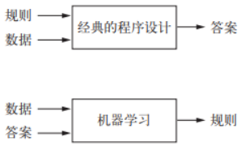
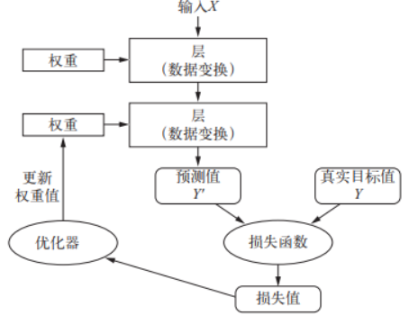
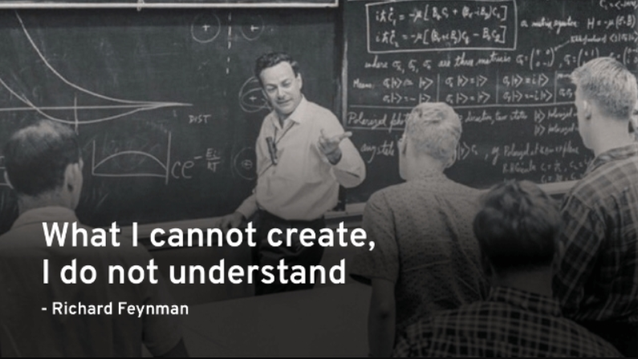
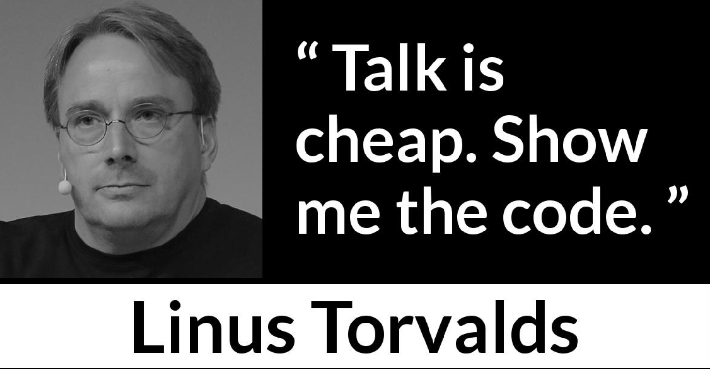

# 1.0 概述

机器学习是研究如何通过计算机来模拟人类学习行为的学科。本文所诉内容为个人对于机器学习之于人类学习影响的一些总结与思考。

机器学习是一种新的编程范式，对于经典的程序设计而言，输入的是规则（算法）和数据，输出的则是答案，也就是对数据进行加工处理。而对于机器学习而言输入的则是数据和答案，输出的则是规则。

机器学习中很多的算法思想本身就是参考人类学习方式，学习行为，进而移植到计算机中。其实反过来思考，这些思想能够在计算机中有效的运行，达成目的，那么对人类学习也具备一定程度上的指导意义。

# 2.0 缘起

大一之时，偶然读到了李开复写的一本书《AI 未来》。这本书激发了我的兴趣，令我对机器学习，人工智能有了全貌的认识。

同时也令我开始思考学习的本质是什么？什么是知识？学习和记忆的区别是什么？如何提高学习能力？以上种种问题都有一个目的：认清学习的本质，从而提高自我。

后续这些问题或多或少都有了答案，其中于建国博士所写的《学习观》对我的影响很大。

这使得我不再盲目，作为一个愚笨之人，在中学时期没有扎实的基础，面对学习始终是惶恐与逃避。面对失败没有认识到反馈的重要性，当一些方面取得成绩后也不知原因。

当习得这些知识后，我认识到了学习是一件科学的事情，一件可控的事情，可以随着个人的意志所转移。某种程度上这给我带来了一些自信。

# 3.0 思索和总结

机器学习是通过训练集来训练参数，通过损失函数来判断模型训练结果同真实值之间的差距，进而得到反馈。通过反向传播，梯度下降等一些算法来调节参数。通过验证集对判断模型优劣程度进行初步判断，查看泛化能力。通过验证集判断模型最终的优劣程度。我认为这一整套流程下来和人类学习是非常相似的。

以学生高考为例，其中训练集就是日常做题。在学习过程中的有答案的题目是监督学习，无答案的题目则是无监督学习。我认为对于初学者而言，监督学习比较有效，无监督学常常体现在思维发散性，探索性的题目中因为没有固定答案。学生写完题目后查看答案从而判断对错，根据对错来反馈调节自身认知，从而进一步加强对题目蕴含知识的掌握程度。经过数次迭代，不断的写题，进行模拟考试，模拟考试其实就是验证集，对模型进行初步判断，根据结果调节超参数。而高考则是最终的测试集，体现模型最终优劣的程度。

## 3.1 什么是学习？

学习是压缩知识的过程，通过有限的例子寻找其中的规律，而这个规律就是知识。

我认为学习是一个动词，其实学习对应到机器学习中也就是模型在训练集中训练的过程。机器学习中的学习是为了寻找更好的数据表示，我认为人类学习也是相似的，也是在寻找更易于理解的知识表示。

其中存在的问题则是，妄想通过记忆所有情况来解决问题。实际中常常有人为了省事而这样做。

> 例如期末考试记忆书中原题，死记硬背也来源于此。

实际情况则是是所有情况的记忆量很大（其实是无穷，如果能枚举所有情况就不需要学习了），一则记不住，二来即使记住不仅要考虑遗忘问题，还要考虑问题的灵活变化，也就是泛化能力不行。

所以学习的过程不应记忆例子本身，而应该记忆例子中所蕴涵的规律。通过信息来提取知识。

> 例如文科因为规律不普遍，所记记得多，理科则重逻辑（比如一个公式是很多自然现象的总结），记忆少。

后来我又学到了一个新的名词，即“元信息”。元信息的定义是描述信息的信息。简而言之就是 C 语言中的结构体，进一步而言就是面向对象中的类。

当我认识到元信息的概念后转念一想这不就是知识吗，和知识的本质是何其相似。我认为二者的本质是相通的。

在机器学习中，知识其实就是一个模型通过训练集训练后得到的一系列参数。

## 3.2 如何验证自己是否掌握知识？

有一个从小到大老师父母经常说的方法，那就是给别人讲一遍。通过讲解可以清晰的认识到自己对该知识点的掌握情况，哪点卡住了，面对别人疑惑的地方能否清晰明了的解释？当这些问题都不再是问题后，该知识点可以证明自己是真的掌握。

但是为什么这样做有效？这其实就是掌握了知识的威力。

通过训练集来训练自身加深自身对知识的理解，给别人讲题相当于测试集来判断自己的理解情况。这个过程势必会出现自己之前没有遇到的例子，如果根据已有的知识来解决这个新的问题，这也就说泛化。

其实费曼先生的话也蕴含同样的道理。

对应于机器学习中，给别人讲题其实就是在找验证集/测试集来判读自身所学情况。如果效果很高那么则证明模型泛化能力强，优秀。

## 3.3 如何有效的学习一个知识？

通过例子来学习可以快速有效的掌握一种知识。

> 例如学习一个概念知识，老师直接讲定义会令人费解，但是举一个例子就显得通俗易懂。

这在神经网络中同样存在实例，直接训练模型就是通过一个又一个的实例（一条数据）来不断的训练模型，通过该数据模型“学”到了一系列的参数。这个过程就说学习，也称为“数据蒸馏”。

但是为什么这样做很有效？

以下是我的理解：

我觉得另外一个问题会得到答案，也就是知识的应用场景。在实际场景中，面对一个问题，应用该知识来解决这个问题是需要一个过程的，根据已有的信息通过知识的组织来一步步推断，最终解决该问题。

如果记忆的是信息而非信息之间的关系（知识），那将无法将这些组织这些信息，什么时候用，如何用都是问题。面临实际问题时则会碰钉子，无法解决。其实就是在测试集上表现不好。

所以这个过程是无法避免的，所以通过例子能快速的将流程走一遍，习得该信息的组织方式，这也就是知识。所谓重塑大脑链接。

## 3.4 反馈！！！

反馈的力量是无穷的，反馈之于人就像损失函数之于机器学习。损失函数能引导一个模型向越来越好的方向前进。损失函数越优秀，模型的学习能力越强悍，可以在短时间内训练出很高的精度。

从损失函数中其实可以认识到反馈对学习的影响。实际情况中我们则常常潜移默化的应用这一方法，例如做作业需要对答案，根据答案来调整自身对知识的认识。这也是监督学习，我在做练习之时也更倾向于答案的习题，无监督学习无法令我明确自身对于知识的把握程度。当正真掌握一个知识，体现发散思维之时无监督学习会有优势。

在机器学习中，直接体现反馈是通过优化器来实现的，根据差值来更新权重。更新权重的算法有很多，例如最简单的挨个尝试，但是参数很多，时间复杂度是指数级别的，显然不现实。还有梯度下降等算法，可以加速算法收敛，以更快的速度调节参数。

如何衡量反馈其实是有很多数据特征的，例如常见的均值，方差，混淆矩阵，甚至 ROC 曲线等一系列指标都是为了更全面的评估一个模型，一个算法的好坏。

反馈的前提是有明确的输入输出，没有明确的输入输出就是瞎搞。

## 3.5 输入和输出

当写一个函数之时，首先要考虑的就是函数签名，也就是函数的输入，其次是函数的输出，然后才是函数体。

我们需要切实考虑训练集的场景，如果训练集的目标和测试集的目标存在差异，那么再怎么训练模型都不会有很好的效果。

类比到人类学习，也是一个同样的过程，在学习之时输入与输出是相对应的。

> 例如学习英语之时为什么看带字幕的电影时无法很好的掌握听力这项技能，我们获取信息不仅仅是从声音中，还有字幕的存在。字幕更像是拐棍，起到了辅助作用。而实际交流考试中是没有字幕的存在，没有了拐棍自然无法更好的前行，卡住等等问题会接连不断的冒出来。

> 例如背单词时会先思考中文意思，然后再映射到现实世界。例如 nine ，往往不是脑子中直接蹦出 9 这个数字，而是从 1 数到 9 。中文的掺入大大降低了英语交流的速度，在实际交流中往往反应不过来。就像 JVM 一样，不是直接翻译成二进制代码，而是字节码转译成二进制，速度略慢。

类似的问题存在不少，当我们面对一些学习困境时，比对人生中的”训练集“和”测试集“之间的差异往往会令人豁然开朗。

## 3.6 知识类型

世界是绚丽多彩的，知识的类型也是复杂的。

以上所提及的知识大多是思考类型的，还有一种知识是运动类型的，如果二者混淆很难有明显的提升。

例如游泳，学一辈子理论都不如实际的游一圈，又或者说大量重复的实践产生肌肉记忆。

其实我认为编程也夹杂着运动类型的知识，如果仅看书中理论，不去动手实践很难有全面的认识。就像木匠一样，知识是在不断实践中得到的，实践也在反哺知识，其实就是螺旋式上升，二者结合从而提高认知。木匠体现自身水平的应该是自己的作品，例如龙椅是我做的，这显得水平很高。程序员其实也等同，这就又回到那句经典的话了 ：Talk is cheap. Show me the code.

# 4.0 总结

机器学习是人类学习经验的总结，重要的是这些模型都是有效的。这更像是一笔宝藏，是人类学习经验的精华。

机器学习之于我而言则是令我明白了学习是科学可控的。透过机器学习拨开了我眼前对于学习的迷雾。

机器学习也是一门交叉学科，有时也常常惊叹，人脑的功耗只有 20w ，这个数字远低于计算机，但是却能做出那么复杂的工作。

知道的越多，不知道的更多。当我们面对一些人生困境时，比对人生中的”训练集“和”测试集“之间的差异往往会令人豁然开朗。

# 参考

1. 《AI 未来》
2. 《学习观》
3. 《Python 深度学习》
4. 《机器学习》
5. 《统计学习方法》