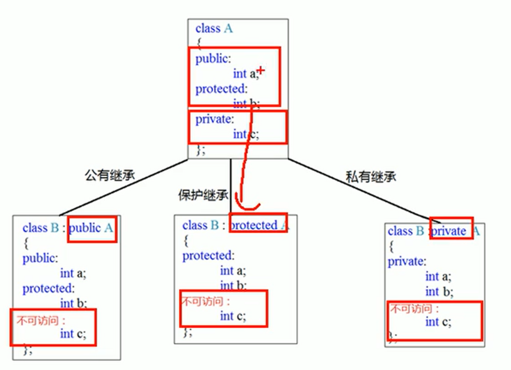

最近需要用到 C++ ，整理回顾了一下。

以下内容为第一次阅读《C++ Prime Plus》所记的笔记。做了部分删减，前十一章的内容。内容有点混乱。仅供参考！

除此之外还有这个[视频](https://www.bilibili.com/video/BV1et411b73Z)，看了三天。顺便把案例写了一遍，[repo](https://github.com/rainjw/cpp-study-cases)。

最后的那两个项目不想做了，写下来估计得几千行，后续有时间再做吧。最近 C++ 学的有点过头，先缓缓。

## 0. C++ 简介

C++ 的三大法宝：继承 C 语言，支持面向对象，支持模板特性。

C++ 融合了**过程性编程**，**面向对象**和**泛型编程**三种不同的编程方式。

如果学过 C 语言，再学 C++ 需要摒弃一些编程习惯。反之没有学过 C 语言直接学 C++ 则需要学习 C 语言的知识，需要对 C 语言的知识有较深入的了解。

了解 C++ 前需要先了解 C 语言。

开发操作系统时需要一种能够直接，简洁，高效且有效控制硬件的语言。

虽然汇编可以直接操作硬件，但是不具备可移植性，也就是说汇编语言针对不同的硬件有特定的实现方式，换台机器就无法运行。

于是开发出了 C 语言。可移植性采用编译器来实现，通过编译器将 C 语言编译成机器码，不同的硬件环境通过编译器不同的编译方式来**抹平差异**。实现了同一代码可以在不同的机器上运行。

C 语言的设计理念是**过程化编程**，**结构化编程**，**自顶向下设计**。

虽然结构化编程提高了程序的清晰度，可靠性，且便于维护，但是当程序变得很大的时候，结构化程序就显得无力了。

面向对象编程（OOP）提供了一种新的方法，设计与问题本质特性相对于的**数据格式**。本质上都是为了更大程度上的**复用代码**。

泛型同样是为了复用代码，采用尽可能少的代码来完成。因为存在很多数据类型，所以泛型的目的则是同一套代码支持不同的数据类型。

C++ 是静态类型的语言，类型检查发生在编译期，所以变量必须声明数据类型。与之相对应的是 Python，动态数据类型，直到程序运行时才能确定数据类型。


## 2. 可移植性

可移植性指的是程序的可移植性，也就是一套程序可以在不同的机器上运行不出错。

可以从**内因**和**外因**两个角度来看待**可移植性**。

从内因来看，程序是由语言编写出来的，语言存在多个版本，语言的差异也会影响可移植性，不同版本的语言会导致问题产生，所以尽量使用同一版本或者兼容其他版本。

而从外因来看，影响因素则主要是硬件，针对特定的硬件而实现的功能是无法移植的，需要重新修改代码，注意避免这种情况。

常见的 C++ 版本有： 

1. 1998 年制定的 C++98 标准。
2. 2003 年制定了 C++2003 标准，但是没有增加新特性，所以本质上还是 C++98 标准。
3. 2011 年制定 C++11 标准，增加了很多新特性，目的是消除不一致。

ISO C++ 吸收了很多 ANSI C 语言标准，可以认为是 C 语言的超集。

其实 C 语言也借鉴 C++ 增加了其添加的新特性，例如 const，目前最新的 C 标准为 c99 。

C++ 的扩展名，也就是文件后缀名为 CPP，即 C plus plus 的缩写。

最初的 C++ 代码是转换为 C 代码，然后编译器再将 C 代码转换为机器码。也称为 cfront，表示 C 前端。

后续随着 C++ 的普及越来越多的编译器实现了直接将其转为机器码，加速了编译过程，同时也强调 C++ 是独立的语言。

## 3. 使用 C++ 

C++ 对大小写敏感，注意区分大小写。

```cpp
int main() {
    statements;
    return 0;
}
```

第一行是**函数头**，花括号中包含的部分为**函数体**，而 main 则是**函数名**。

函数头对函数的功能和其他部分之间的接口做了总结。

函数头通常作为接口，方便被调用。

main() 函数不被其他函数调用的，而是被**启动代码**调用。

编译器将**启动代码**添加到程序中使得操作系统可以通过启动代码来**调用** main() 函数。

可以将启动代码理解为**程序**和**操作系统**之间的**桥梁**，main() 函数为操作系统提供了接口。

main() 函数在历史上存在多种风格。

最初经典的 C 函数头为 :

```cpp
main()
```

因为在 C 语言中省略返回值类型就默认函数类型为 int ，所以可以这样写。

后续 C++ 淘汰了之上的写法，改为了如下的写法：

```cpp
int main(void)
```

void 表示函数不接受任何参数。

在 C++ 中 `int main()` 等效于 `int main(void)` 但是在 C 中二者不等效，前者表示对于是否接受参数保持**沉默**，而后者则明确表示不接受参数。

下面写法也可以在多种操作系统上运行，但是不是标准格式，应避免使用。

```cpp
void main()
```

有人认为 `return 0` 繁琐，制定 ANSI/ISO C++ 标准时对此做出了让步，允许最后不写 `return 0`，但是仅限于 `main()` 函数，其他函数不允许。

常规下，程序运行必须通过 `main()` 函数开始，如果没有的话程序将不完整编译器，最终导致报错，但是也存在例外情况。

以 # 开头的都是**编译指令**，**预处理器**会来处理这些编译指令，下面的编译指令可以理解为将 iostream 文件中的代码在源代码编译之前替换到此处，编写的代码和该文件形成复合文件。

```cpp
#include <iostream>
```

C 的头文件风格是 .h 为后缀，例如 `math.h`。

C++ 虽然支持 C 风格的头文件，但是自己也做出了一些修改，对于自己的头文件没有后缀名，对于 C 的头文件支持将后缀去掉，开头加上 c 。如 `math.h` 改为 `cmath`。

这种修改不仅仅是格式上的改变，没有 .h 的头文件可以包含**名称空间**。

`using namespace std;` 这是一条 using 编译指令，实现了 std 的名称空间。

名称空间是 C++ 的特性之一，目的是方便**组合代码**和**组织程序**。缺点则是不同模块间存在**命名冲突**，也就两个模块中存在相同命名的函数从而导致执行出错。

解决命名冲突的方式就将该模块的名称作为**前缀**加上去，因为模块名是不同的。

例如两个模块 A，B 中都存在名称为 c 的函数，那么直接使用 c 函数会使得运行时矛盾，所以将其改为如下方式即可：

```cpp
A::c();
B::c();
```

双冒号是访问的意思（::）。

而对于 cin/cout 而言的全称就是 `std::cout<< "";` / `std::cin>>"";`

因为 `using namespace std;` 的提前声明，所以可以省略 std 直接使用 `cout << ""`/`cin >> " "`。

输出语句：`cout << endl` 

其中 `<<` 运算符其实也是左移运算符，此处作为输出其实是运算符重载，也就是在此处使其变成了别的含义而非左移位。同理 `>>` 也是。

endl 是换行的意思，也位于 std 名称空间中。

C++ 也支持 C 的换行方式，`\n` 。

## 4. 变量命名规则

1. 只能由字母，数字和下划线组成。
2. 第一个字符不能是数字。
3. 区分大小写。
4. 不能使用关键字。
5. 以两个下划线或下划线和大写字母开头的名称留给编译器使用。以一个下划线开头的名称留作全局标识符使用。
6. C++ 对于名称没有长度限制，但是在有些平台上存在长度限制。

## 5. 数据类型

### 5.1 整型

整型指没有小数部分的数字，例如 1，2，3，-1 ...

根据整型的范围，C++ 提供了多种类型的整型，例如 char，short，int，long 和 C++11 新增的 long long ，

并且每种整型都存在有符号和无符号两种类型，符号例如负号，所以一共有 10 种整型，而 char 常常用来表示字符而非数字。

在计算机内存中，信息是由 **0/1** 组成的，一个 0/1 表示**一位（bit）**，是信息的最小单位。而 8 个 0/1 则组成了一个**字节（byte）**。

C++ 对于数据类型的范围没有准确的定义，在不同系统或不同的编译器上有不同的范围，具有弹性，但是遵循以下几个规则：

1. short 至少 16 位；
2. int 至少与 short 一样长；
3. long 至少 32 位，且至少与 int 一样长；
4. long long 至少 64 位，且至少与 long 一样长；

一字节有 8 位，每一个位置存在 0/1 两种情况，所以一字节可以表示 $2^8$ 种情况，那么范围就是 $[0,255]$ 或 $[-128,127]$。

1KB 等于 1024字节， 1MB 等于 1024KB 

C++ 存在多种整数类型，选择范围小的数据类型虽然**占用空间**小，但是一旦遇到范围大的数据程序就崩溃了。反之选择范围大的数据类型虽然能够承受的较大的数据但是**占用内存**大。

如果没有要求，在数据范围和占用空间的权衡之下一般情况下选择 int 。

切记不要混用带符号类型和不带符号类型。因为强制类型转换时和想象中的不一致，根源在于补码。也就是无符号类型采用的不是补码，和有符号类型采用补码表示。

> 例如 `unsigned a = -1` 转换为 int 后 `a = 4294967295` 。

### 5.2 字符型

对于字符型 char ，称其为整型的原因是对于存储的本质其实是一个整型的数字，只不过输出时实现了将整型转换为字符的映射。

例如对于 ASCII 码而言，字符 M 对应 77，输入 M 后，根据 ASCII 码的转换规则，在计算机内部存储的是 77 。当输出 M 时，cout 将 77 转换为了 M 显示出来。

字符串（string）实际上是由字符（char）组成，也就是一个字符数组。

### 5.3 浮点型

浮点数就是小数，例如： 1.1，1.542，3.1415 等等。

对于 3.1415926 而言，如果改为 0.31415926（基准值） ，只是修改了小数点的位置，那么修改后的数字称为**基准值**，因为移动了两位，所以称 100为**缩放因子**。

缩放因子的作用是移动小数点的位置，浮点数也因此得名。对于计算机内部而言，因为是二进制，所以缩放因子是 2 的幂，而非目前 10 的幂。

注意 8.0 也是浮点数，因为存在小数点。

另外一种表示法类似于，3.6E6 ，其中 E6 指 $10^6$ ，那么 E7 则指 $10^7$。而 3.6E-2 则表示 $0.036$。

C++ 的浮点类型有 3 种：float，double 和 long double 。

float 的有效位至少为 32 位， double 至少 48 位且不少于 float ，long double 至少和 double 一样多，这三种有效类型可以一样多。

通常 float 为 32 位，double 位 64 位， long double 位 80，96 或 128 位。另外这三种类型对于指数的限制范围至少是 $[-37,37]$ 。

与整数相比，浮点数表示的范围更大，其次是可以表示整数之间的值，但是随之缺点则是**运算速度慢**且**精度降低**。

传递参数时，将 float 参数提升为 double 可以提高程序的兼容性，因为范围扩大了。

## 6. 复合类型

数组是一种数据格式，用来存储多个同类型的值。C++ 数组的索引从 0 开始。

数组中没有赋值的位置都用 '\0' 来占位。

strlen() 函数返回字符串长度（不包含空字符）。

sizeof() 函数返回的是整个数组的长度。

cin 输入时以单词为单位进行判定。

strcat() 将字符串附加到字符数组末尾。注意如果是字符数组的话空间小可能会导致程序奔溃，而对于 string 会自动申请空间不会导致程序崩溃。

strcpy(a,b) 将 b 复制到 a 上。

size() 是 string 类的一个函数，可以用来计算**字符串长度**。例如 `string a;` 其长度为 `a.size();` 。

strlen() 是一个类库 `#include <cstring>` 里面的函数，可以用来计算**字符数组的长度**。

在 C++ 中声明结构体变量时可以省略 struct 关键字。

共用体和结构体在同一时间内使用共用体时只能使用一种数据类型。使用场景如商品名字既有整型也有字符型可以采用共用体。优点是节省内存。

指针变量增加 1 后，变化的是该指针变量指向的数据类型的**单位字节**大小。例如指向 double 变量的指针加 1 后，因为 double 是 8 个字节，所以指针数值会增加 8 。

数组索引和指针之间的转换 ：`s[1] == * (s+1)` 。

对于 `int *a` ，其中指针是 a ，而 *a 是一个整型变量。

静态声明：`int a[100]` 是静态声明一个数组，编译时会将空间写死。

动态声明：`int * a = new int[size];` 则是动态声明，根据运行时数据的变化来动态的申请空间。

数组名是第一个元素的地址。采用 cout 输出数组名可以直接输出数组中第一个元素。

new 是在运行时创建数组，可以根据输入数据动态改变。如果不采用 new 直接声明一个数组变量则表示是编译时创建，空间大小就提前写死了，后续无法修改。

`->` 和 `.` 都是访问成员，但是在创建动态结构中，只能使用前者。也就是前者是指针调用，后者则是实体调用。当然指针也可以用点号，注意要将 * 阔进去。`(*a).k;` / `a->k;`

## 7. const

const 保证了变量中所存内容不能被改变。所以必须被初始化，因为随机赋值后续无法被修改也就没意义了。

> 例如月份必定是 12，可以使用 const 关键字来设定一个不变的常量。`const int Month = 12;`

注意，如果声明的时候没有赋值，系统会随机赋一个值，而因为 const 的不变性使得后续的赋值都无效。

```cpp
const int Month;
Month = 12; // 失败！！！
```

引用必须初始化，引用初始化后不能被改变！

> 但是为什么？最初我是无法理解的，但是理解本质后非常简单。其实引用本质上是一个 const 修饰的指针常量。`int& r = a;` 等价于 `int * const r = &a;` ，const 限定了 r 的值不能变化，所以以上两句话就显得很合理的。


虽然 #define 也可以提供类似的功能，但是 const 要优于 #define 。因为 const 明确了变量类型，其次是可以将其限定到特定的函数中，最后 const 可以应用于数组和结构体。

ANSI C 版本也借鉴了 C++ 的 const 关键字，支持这种写法。


## 8. auto

C++11 新增了一个工具，使得编译器可以根据初始值来判断具体的数据类型。

例如，不用直接声明数据类型，可以根据初值来判断具体类型。
```cpp
auto n = 100;
auto x = 1.5;
```

## 9. 循环和关系表达式

前缀 `for (int i = 0; i < n; ++i)` 和后缀 `for (int i = 0; i < n; i++)` 的区别？

> 从逻辑上二者并没有任何区别。但是在实际使用中，前缀要比后缀效率更高，原因是前缀直接加一，而后缀需要提前复制保留一个副本然后加一在返回副本。

注意 ++ 的运算符要高于 * 。

> 例如：x = *pt++ 实际上等价于 x = *(pt++) 。

`while(name[i] != '\0')` 等价于 `while(name[i])`。

> 因为 name[i] 存在字符，其编码为非零值或则 true ，所以循环条件成立，反之当遇到空值字符编码值为  0 或 flase，而且后者不用判断速度更快。

## 10. 分支语句和逻辑运算符

`if (3 == myNumber)` 要优于 `if (myNymber == 3)` 。

> 因为一旦 == 写成 = ，前着的写法编译器可以马上检测出来，而后者则会默认成赋值成功，继续执行下去。

! 运算符的优先级要高于其他所有关系运算符和算术运算符。

> !a && b 等价于  (!a) && b 。

?: 运算符虽然简洁但如果逻辑复杂会使得难以理解，所以逻辑复杂时用 if-else，逻辑简单时采用 ?: 。

## 11. 函数

定义一个函数分为**定义**，**提供原型**和**调用**三方面。

函数分为**有返回值**和**无返回值**两种类型，其中无返回值的函数称为 `void` 函数。

C++ 对于返回值类型有限制：**不能是数组**，可以是其他任何类型--整数，浮点数，指针甚至可以说结构和对象！

虽然 C++ 的返回值不能是数组，但是可以通过结构和对象的组成部分来间接返回数组。

函数原型提供了函数到编译器的**接口**。

没有函数原型也可以，但是效率不高，编译器必须暂停对 main() 函数的编译，去单独编译函数再将其组合起来。除此之外，C++的编程风格通常将 main() 函数放在最前面。

参数传递是如果类型不一致会导致参数强制转换为期望的类型。

C++ 和 C 一样可以将数组名视为指针。

二维数组和指针之间的转换：`ar2[r][c] == *(*(ar2 + r) + c)` 。

C 和 C++ 都可以自己调用自己，也就是递归，但是 C++ 不允许 main() 调用自己。

函数地址就是函数名。

内联函数提高了程序的**运行速度**。虽然和常规函数的编写方式不同，但是**主要区别**在于组合和到程序中的方式。

执行普通函数时需要进行跳转到函数所在位置去执行代码，执行完毕后再跳转回来。

内联函数不一样，将函数直接放在调用函数的位置上直接执行而不跳转，虽然节省了时间但是也增大了内存的消耗。

内联函数对于时间的优化在于调用函数的过程。

如果**执行函数**所占的时间大于**调用函数**的时间，那么使用内联函数节省的时间会比较少。反之如果**执行函数**的时间小于**调用函数**的时间，那么使用内联函数可以节省大量的时间。

除此之外如果该函数经常被调用也会节省大量的时间，反之则节省的时间较少。

内联函数不能递归。

内联函数和普通函数的区别在于前面加了 inline 关键字。

```cpp
inline double square(double x) {return x * x;}
```

在 C++ 中 & 运算符除了做取地址的功能外还可以作为变量的引用。

可以将引用理解为别名，因为指向是同一块内存地址！所以后续的操作都体现到了同一个对象身上，区别就是名字不同。

> 例如： `int a = 101 , int & b = a;` 此时 b 是 a 的一个引用，也可以认为是别名，二者的地址相同。

和指针不同的是在声明时就要初始化。

> 例如： `int a , int & b, b = a` 会报错。

和一个变量关联后就不能修改！

> 等价于：  `int & a = b; int * const a = &b;` 具有和 const 类似的功能。

**值传递**和**引用传递**的区别在于，前者是产生了一个副本，而后者则是实实在在的在本体上进行的修改。

可以采用引用函数参数来实现引用传递。

```cpp
void grumpy(int &x)
```

三种传递方式：

```cpp
void swapr(int &a, int &b); // 引用传递
void swapr(int *a, int *b); // 地址传递
void swapr(int a, int b); // 创建了两个新变量，副本
```

泛型使用举例：注意 template 和 typename 是固定的，而 T 可以随意定义。

```cpp
template <typename T>
void Swap(T &a, T &b) {
    T t;
    t = a;
    a = b;
    b = t;
}
int main() {
    int a = 1 , b = 2 ;
    Swap(a, b);
    cout << a << " " << b << endl;
    return 0;
}
```

编写模板的时候，往往先按特定的数据类型编写，编写完成通过测试数据后再修改成模板。

模板的局限性在于，如果针对数组或结构模板化可能会导致某些常规的运算符无法使用。

> 例如 a > b 如果 a 和 b 都是数组，那么 > 就无法比较了。同样，如果 T 是数组，指针或结构，那么  `T c = a*b;` 中的 * 也就不成立了。需要**重载运算符**。

## 12. 初始化和赋值的区别

初始化是在创建变量时赋予的初始值，而初始化是将对象的原始值擦除，采用新值来替代。

所以二者并不等价！
## 13. 声明（declaration）和定义（definition）的区别

定义分配了内存空间而声明没有！使用场景一般是多个文件中，一个文件要使用另外一个文件中已经定义好的变量，那么在该文件中则需要先声明！ 

> 声明采用关键字 extern 实现，例如：`extern int a`。 声明和定义不能同时使用，这是错误写法： `extern int a = 1` 。

## 14. 野指针和悬空指针

初始化所有指针！因为未经初始化的指针会被随机赋值，也就是野指针。如果随机赋值恰好指向了某个存值的地址那么就无法区分该值是否合法。

还有一种悬空指针，表示指针指向的内存空间被释放了，那么该指针就是非法内存访问了。

野指针和悬空指针都是指向无效的内存区域。
## 15. 文件编译

所有的函数不一定都位于同一个文件中，往往会分散在不同的文件中。但如果位于两个不同文件中的函数使用了同一个结构体，如果每个文件都写一遍结构声明的话势必会造成冗余，而且修改时要修改两遍。

可以创建一个单位的文件将结构体写入其中，该文件称为**头文件**。另外两个函数所在的文件引用该文件即可，该文件称为**源代码文件**。改动之时只需要改动**头文件**即可。

头文件中不允许写**函数定义**和**变量声明**，如果写的话，而源代码文件也写函数声明则会造成**二义性**从而导致出错，内联函数除外。

头文件包含内容：
* 使用 #define 或 const 定义的符号常量。
* 结构声明。（不声明结构变量，而是告诉编译器如何生成结构变量）
* 类声明。
* 模板声明。（此代码不是被编译的，而是告诉编译器如果生成与源代码相匹配的代表如何编译）
* 内联函数。

`<coodin.h>` 和 `"coodin.h"` 的区别，前者会直接去**库**中查找，后者则是在先去**当前工作目录**下查找，当找不到时再去**库**中查找。

**头文件**一般写在当前的工作目录下，所以一般写成双引号的形式而非尖括号，即：`"coodin.h"`。

编译程序时会先将头文件涉及的代码合并起来，生成一个 `.cpp` 源代码文件。

## 16. 预处理指令

同一个文件中只能包含一次头文件。但是现实往往难以避免这种情况。

为了避免这种情况采用如下的方式来避免：

```cpp
#ifndef a
#define a
// ...
#endif
```

关键字 ifndef 表示 if not define ，也就是先判断 a 是否已经被定义了，如果被定义就直接执行 #endif 后面的语句，反之顺序执行。

这种方法虽然不能防止某个文件被包含两次，但是可以使其忽略除第一包含之外的所有内容。


## 17. 存储持续性，作用域和链接性

C++ 有三种存储数据的方式（C++11 中已是四种）。

* 自动存储持续性：函数或代码块从创建到执行完毕。
* 静态存储持续性：函数外定义的变量和使用关键字 static 定义的变量在整个程序运行过程中都存在。
* 线程存储持续性：（C++11）如果变量是使用关键字 thread_local 声明的，其声明周期和所属线程一样长。
* 动态存储持续性：用 new 运算符分配的内存直到遇到 delete 运算符才将其释放或程序结束。或者称为**自由存储**或**堆**。

函数的**作用域**可以是整个类或整个名称空间甚至全局，但不能是局部的，因为代码块中无法定义函数。

如果变量 a 内部的一个代码块中也定义了一个同名的变量 a ，那么在该代码块中生效的将是新定义的变量 a 。

C++11 之前 auto 是显示的声明一个变量采用自动存储方式，但是没人用。于是在设计 C++11 时又增加了一个自动推导数据类型功能。

变量保存在**栈**中，采用**两个指针**来跟踪栈，一个指针指向栈顶，另一个则指向栈底。栈空间大小可以通过编译器来设置。

关键字 register 用来声明使用 CPU 寄存器来存储变量，为了提高速度。

C++ 有单定义规则，即变量只能定义一次。为了满足这条规则 C++ 存在两种声明变量的方式，一种是定义声明，另外一种是引用声明。二者的区别是前者分配变量而后者不分配。

引用声明采用关键字 extern 且不进行初始化，否则即为定义导致分配空间。

> 例如： `extern int a;` 

作用域解析运算符（::）可以用来访问全局变量。

> 例如：在当前函数中 a = 0.4 ，但是 a 也是全局变量 a = 0.8 ，所以在当前函数中 ::a = 0.8 

被 const 声明的变量内存初始化后就不能再修改。

new 是在堆中找到一个能够满足要求的内存块。

using 编译指令使得所有的名称都能使用。

> 例如：`using namespace std;`  使得 std 中的所有名称都能使用。

而 using 声明只能使特定的名称使用。

> 例如：`using std::cin;` 只能使得 std 名称空间中的 cin 有效。

为了避免名称冲突，尽量不要在头文件中使用using编译命令和using声明。

因为一旦使用后就表明该名称空间中的命名在所有使用该头文件的源代码文件中都有效，项目一大，文件一多容易导致冲突。
## 18. 对象和类

类对象的默认访问控制是 private，可以不用显示声明。

共有部分构成了设计的抽象部分，也就是接口。

类设计要尽可能的将公有接口和实现细节分开。

类声明中可以提供完整的函数定义，也就是编写完整的函数，但是通常单独来写。

## 19. 函数原型，函数声明，函数定义三者之间的关系

**函数原型**指函数签名，函数名，返回类型和访问修饰符。

函数签名指确定的**参数数量**及其**类型**。注意参数名可选，也就是可以不写形参名。

> 例如：`void Sum(int a,int b);` 或 `void Sum(int, int);`  两种类型的函数原型。

**函数声明**的内容和**函数原型**一致，也就是说是通过函数原型来进行函数声明的。下面则是摘录 [wiki](https://zh.wikipedia.org/wiki/%E5%87%BD%E6%95%B0%E5%8E%9F%E5%9E%8B) 上的一段话。

> 函数原型（英语：Function prototype）或函数接口（英语：Function interface）是用于指定函数的名称和类型特征（元数，参数的数据类型和返回值类型）的一种**省略了函数体**的函数声明

**函数定义**指完整的函数，也就是函数体加上函数原型。下面就是一个完整的函数定义。

```cpp
void sum(int a, int b) {
    return a + b;
}
```

函数声明只是告诉编译器该函数的存在，**不分配空间**，直到调用该函数时才分配。而如果函数写在 main 函数之上时可以不写函数声明直接写完整的函数。

## 20. 构造函数

编译器提供默认构造函数，析构函数，拷贝函数三种构造函数。

如果写了有参的构造函数那么编译器提供的默认构造函数就无法使用了！但是默认的拷贝构造函数依旧可以使用。

如果写了拷贝构造函数，C++ 对于其他构造函数均不提供。

在使用对象时往往需要设置相应的属性对应的数据，但是一般这些数据是私有的，所以无法公开访问只能通过共有的成员函数来设置。

而构造函数就是提供这些功能的，实现了对象数据的**绑定**。当声明程序时会自动调用构造函数，不需要设置相应的成员函数，再调用。

构造函数的参数不少类成员，而是赋给类成员的值，注意区分命名。一般有两种区别方式：

对于成员名 a ，一般在尾部加上下划线（_）。

```cpp
private:
    int a_;
```

或者在头部加上 (m_)

```cpp
private:
    int m_a;
```

## 21.析构函数

构造出来的对象是有生命周期的，生命周期结束后会执行**析构函数**来收尾。

编译器决定了什么时候调用析构函数。如果没有提供析构函数编译器会隐式地声明一个默认的析构函数，在对象被删除的代码后执行。

构造函数和析构函数是用来管理类对象的创建和删除。
## 22. 重载
### 22.1 函数重载

函数的返回值不能作为重载的条件，因为会导致二义性。

函数重载的条件：

1. 同一作用域下。
2. 函数名相同。
3. 参数类型不同，参数个数不同，参数顺序不同。

除此之外函数在遇到默认参数时也可能会产生二义性。

函数重载虽方便，但是不要滥用，只有执行相同任务但是使用不同形式的数据时，才采用函数重载。

### 22.2 运算符重载

运算符重载就是在原有意思的基础上添加新的含义。

> 例如： a*b 是乘法的意思，而 int *a 指声明一个指针。对于 * 而言就是一种重载。

运算符重载本身也是多态。
## 23. 深拷贝和浅拷贝

深拷贝指在堆中重新申请内存空间，与之相对应的浅拷贝则指简单的赋值拷贝操作。

编译器的默认拷贝构造函数是浅拷贝实现，那么析构函数删除对象后可能会影响到另外一个函数。可以改成深拷贝，也就是重新 new 对象，在堆中重新开辟空间。

综上，如果存在堆中开辟空间的属性，那么需要将拷贝构造函数改成深拷贝。因为浅拷贝可能存在问题。

## 24. 初始化列表

之前没有学过这种写法，第一次遇到时有点懵，也不知道该如何搜索。没想到这么简单，就是一个初始化赋值而已。

下面两种写法等价！

```cpp
Person(int a,int b,int c) : m_A(a) , m_B(b) , m_C(c) {}

Person(int a,int b,int c) {
    m_A = a;
    m_B = b;
    m_C = c;
}
```

## 25. 对象构造顺序

场景：类 A 调用了类 B ，那么构造函数时的顺序是什么？析构的顺序是什么？

*当类中成员是其他类对象时，会先构造对象成员，再调用本类的构造函数。析构顺序反之。*

> 先构造类 B 再构造类 A 。析构是先 A 再 B！例如 A 是人，B 是手机，在初始化人时发现涉及到了手机，那么会先构造手机。也就是先构造其他对象再构造自身。

## 26. 静态 static

所有对象都共享同一个静态成员函数。

静态成员函数只能访问静态的成员变量。

静态变量不属于类对象，非静态成员函数也不属于类对象。

只有非静态成员变量属于类对象。

## 27. 常函数和常对象

在成员函数后加上 const 后表示该函数是一个常函数。

例如：`void a() const {}` 。等价于 `const int * a;` 表示指针指向地址中所存储的值不能被改变，而指针的指向是可以改变的。

如果非得修改某些变量的值，那么需要使用 mutable 。例如 `mutable int a;` 。

在对象前加上 const 可以将其设置为常对象（`const Person p`）。常对象不能修改属性值，但是如果属性是被 mutable 修饰的话是可以被修改的。

常对象只能调用常函数，因为调用普通成员函数会修改属性。所以本质上还是是否涉及到属性的修改上。

## 28. 继承



继承的时候先构造父类再构造子类，析构反之，先析构子类再析构父类。

## 29. 多态

多态分为静态多态和动态多态，区别在于前者是编译器确定而后者是运行期确定。

虚函数表。

因为虚函数通常需要在子类中重写，没什么意义。因此可以将其改写为纯虚函数，写法：`virtual void func() = 0;`。

只要有一个纯虚函数那么该类就是抽象类。对于抽象类而言无法实例化对象，必须重写父类中的纯虚函数，否则也属于抽象类。
 
## 30. 指针占几个字节？

不管什么类型的指针均占 4 个字节。

指针表示地址，而计算机 64 位，32 位表示通用寄存器一次的寻址能力，也就是地址总线的宽度。因为一个字节等于 8 位，所以 64 位相当于 8 个字节。而 32 位相当于 4 个字节。但是编译器为了兼容 32 位和 64 位系统设定了指针都是 4 个字节。

综上，系统只是决定了指针所占字节数的上限，真正决定具体值的是编译器。

## 31. 抽象类中析构函数要改为虚析构函数

如果不改成虚析构函数，父类会直接调用改析构函数进而导致子类的析构函数没有调用导致内存泄漏。

加上虚析构函数后可以保证父类调用析构函数时作用到子类上。

纯虚函数只需要代码声明即可，而纯虚析构既需要代码声明也需要实现。

纯虚析构写好后该类就属于抽象类，而抽象类无法实例化对象。

虚析构和纯虚析构都是用来解决父类指针释放子类对象问题的。

如果子类中没有涉及到堆区数据，可以不写为虚析构和纯虚析构。

## 32. 模板

1. 如果函数模板和普通模板都可以实现，那么优先调用普通函数。
2. 可以通过调用空模板参数列表来强制调用函数模板。
3. 函数模板也可以发生重载。
4. 如果函数模板可以产生更好的匹配，优先调用函数模板。

为了避免二义性，当使用函数模板后就尽量不要使用普通函数。

模板也存在局限性，例如比较类是否相等，这个问题可以通过重载模板来解决。也就是具体化模板。

学模板不是为了使用，而是在 STL 中能够灵活运用系统所提供的模板。

在模板定义语法中关键字 class 与 typename 的作用完全一样。

除了函数之外，类也存在模板。

类模板和函数模板的区别：

1. 类模板没有自动类型推导。
2. 类模板的模板参数列表可以有默认参数。

类模板中的成员函数并不是一开始就创建，而是在调用的时候才创建。

说白了，模板还是为了尽可能的复用代码！

如果父类是类模板，那么子类继承父类时需要声明模板的数据类型。

如果存在多个文件，声明写在 .h 文件中，实现写在 .cpp 文件中时调用模板会导致编译失败。

因为编译器在扫描 .h 文件时不会去扫描 .cpp 文件，等于没有编译模板那一部分的代码。下面有两种解决方法：

1. 直接引入 .cpp 文件。
2. 将声明和实现写在一起，然后将 .h 文件改为 .hpp 文件。（推荐）

导致这个问题的本质原因还是类模板调用成员函数时是在调用阶段，导致链接不到文件。

## 33. STL

STL 存在六大组件：容器，算法，迭代器，仿函数，适配器（配接器），空间配置器。

容器分为序列容器和关联容器，前者强调元素之间的相对顺序。

> 更新于 2021/02/08 2:09 

