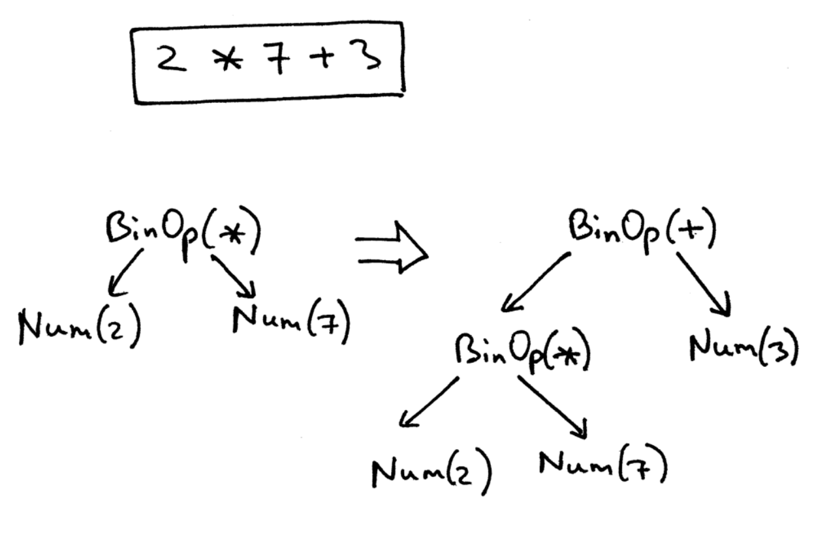

# 0. 前言

最近发现了一个很有趣的[项目](https://github.com/rspivak/lsbasi/)，加上编译原理还有没有考试。所以花了两个星期的时间来做，整体写下来收获很大。下面是一个踩坑记录，一些心得体会以及总结。

内容涵盖了词法分析，语法分析，语义分析，递归下降分析，抽象语法树（AST），作用域，函数，报错信息，调用栈等内容。这是我目前能想到的，除此之外里面有很多细节不写代码是体会不到的。

我的代码：[repo](https://github.com/weijiew/lsbasi) 。

为什么不写 C 编译器，而是写 Pascal ？ 

最初我也有这个疑问，这个疑问是在看视频的时候得到解答的。答案很简单因为 C 的成分复杂，语法结构不规整，不适合初学者。与之相比 Pascal 就比较规整，简单，实现起来比较方便。

下面一些建议，应该可以帮你节省很多时间。

1. 一定要掌握调试技巧以及快捷键，跟着流程走一遍很多问题迎刃而解。

我的环境是 Win10，Pycharm，Python3.6 。下面是 Pycharm 调试快捷键。

一般的调试步骤：执行代码（F8） => 跳入函数中（F7 碰见函数就跳，Alt+Shift+F7 只跳入自己写的函数） => 退回来（shift + F8） => 跳到下一个断点（F9）

2. 如果看不明白文章写的内容的话，输入例子，调试一遍，知晓每一步的流程能解决 80% 的问题。剩下的问题可以忽略，可能是埋的雷，后文会有解释。
3. Part 7 和 Part 14 是两个难度跃迁的章节，其他章节都很平滑。
4. 如果看不明白或者掌控不住可以重新开始。这不会耽误很多时间，恰恰相反就能搞定。

> 例如我看到 Part 7 的时候卡住了，大概花了四五天的时间。但是从头开始再看加上重写代码一天就搞定了。根本原因在于看的太快忽视了很多细节！也就是思考的少。

5. 建议根据问题自己先实现一个版本，如果写不出来就直接看答案吧，别死磕浪费时间。反之如果写出来了，再看答案会发现自己写的很乱，有很多细节没有想到，接下来重构即可。

6. 开始的时候语法树很简单，但是后续就很复杂了，可以结合着调试器来分析。一定要结合着图来看，知晓每一步的目的，不然太抽象。也就是解释器代码（Python），语法树图片和被解释的源码（Pascal）三者之间的映射要理解到位。

# Part 1

首先定义字符串变量，方便后续操作，含义就是字面意思。

```python
EOF, INTEGER, PLUS = 'EOF', 'INTEGER', 'PLUS'
```

## 1. Token 类

首先要明白编译原理中的 token 是什么，中文意思是标记。

> 例如 1+2 中含有三个 token : 1, +, 2 。其中 1，2 都是 INTEGER 类型，而 + 则是 PLUS 类型。

那么抽象出来的 Token 类就会有类型和对应的值两个属性。构造函数如下：

```python
class Token(object):
    def __init__(self, type, value):
        self.type = type
        self.value = value
```

在此之前需要介绍一下魔法方法。类似于 `__xxxx__()` 这种类型的方法都被称作魔法方法。

当使用 print 输出对象的时候，只要自己定义了__str__(self) 方法，那么就会打印从在这个方法中 return 的数据。反之打印的则是对象的内存地址。

更多魔法方法相关内容可查看：[英文版](https://rszalski.github.io/magicmethods/) / [中文版](https://pycoders-weekly-chinese.readthedocs.io/en/latest/issue6/a-guide-to-pythons-magic-methods.html) 。

除此之外 Token 类中还有两个函数。都是为了方便调试！

```python
    def __str__(self):
        return "Token({type},{value})".format(
            type=self.type,
            value=repr(self.value)
        )

    def __repr__(self):
        return self.__str__()
```

上面这两个函数如果没见过可能会有疑惑。不过这个不重要，下面是区别，了解即可。

__repr__ 目的是为了表示清楚，是为开发者准备的。

__str__ 目的是可读性好，是为使用者准备的。

__str__ 实际上调用了 __repr__ 。

具体可参考[Python的两个魔法方法：__repr__和__str__](https://blog.csdn.net/sinat_41104353/article/details/79254149)。

## 2. 主函数

我觉得在描述解释器类之前有必要知晓流程，也就是主函数 main 。

```python
def main():
    while True:
        text = input('cin> ')
        interpreter = Interpreter(text)
        result = interpreter.expr()
        print(result)

if __name__ == "__main__":
    main()
```

写成死循环是为了方便测试，输入一个结果输出一个结果。

首先输入字符串（text），根据字符串构造一个解释器（Interpreter）对象，然后调用成员方法来解析字符串内容。

输入的字符串本质上是一个算术表达式。测试如下：

```python
cin> 5+6
10
cin> 6+6
12
cin> 7+7
14
cin> 
```

## 3. Interpreter

该类是主要流程，解决了将字符串转换为 Token 并计算其结果。

因为现在只处理一个简单的逻辑，所有东西都写到了这个类里面，后续扩展后会剥离模块。

里面共有四个函数（`__init__`、`error`，`get_next_token`，`expr`），第一个是构造函数。

先看构造函数 `__init__` ，然后看 `expr` 知道调用顺序。

```python
class Interpreter():
    def __init__(self, text):
        # 存储完整字符
        self.text = text
        # 指向当前所扫描的字符
        self.pos = 0
        # 指向当前所拿到了 token
        self.current_token = None

    def error(self):
        return Exception("Error parsing input")


    def get_next_token(self):
        """返回值 Token ，将 pos 指向的值变为 Token"""
        text = self.text

        if self.pos > len(text) - 1:
            return Token(EOF, None)

        current_char = self.text[self.pos]

        if current_char.isdigit():
            self.pos += 1
            return Token(INTEGER, int(current_char))

        if current_char == '+':
            self.pos += 1
            return Token(PLUS, '+')

        self.error()

    def expr(self):
        """拿到当前扫描到的 Token 序列"""
        left = self.get_next_token()
        op = self.get_next_token()
        right = self.get_next_token()

        return left.value + right.value
```

到目前为止，expr 函数只能处理一位整数的加法操作

接下来开始进化！这个函数看起来很单薄，在该类中增加一个 eat 函数。
目的是为了验证当前函数类型并拿到下一个函数的 Token 。

函数变动如下：

```python
    def eat(self,token_type):

        if self.current_token.type == token_type:
            self.current_token = self.get_next_token()
        else:
            self.error()

    def expr(self):
        # 拿到当前扫描到的 Token 序列

        self.current_token = self.get_next_token()
        left = self.current_token
        self.eat(INTEGER)

        op = self.current_token
        self.eat(PLUS)

        right = self.current_token
        self.eat(INTEGER)

        return left.value + right.value

```

你可能会很疑惑为什么 eat 函数要加上 token_type 参数来做判断。说实话我第一次看到的时候也很迷惑，但是后续发现这样做很有必要！当然后续也会出现不做验证的 pos 递增函数。

这样做的目的本质上是为了保证所写代码符合定义的文法。也就是来验证是否符号文法定义，否则就不按照该分支走。目前的文法很简单没有分支，所以感受不到存在的意义。但后续的文法会很复杂，存在多个分支，验证就显得很有必要了。现在不理解也无妨，继续做下去就明白了。

完整代码：[part1](https://github.com/weijiew/lsbasi/blob/main/part1/calc1.py) 。

> 至此 PART 1 结束，建议打开 IDE 自己顺着逻辑写一遍，应该会存在一些问题，重点关注这些问题！

> 建议能够独立写出后再开启下一章，否则你依旧需要回头看，因为很多东西仅仅看一遍理解不到位！这些篇文章正是我在回头看时写下的。:) 

# Part 2

之前的代码仅支持两个一位整数加法操作，和实际情况差别很大。接下来的功能一点点添加。

首先完善减法操作。这个逻辑其实非常简单！照着加法改就好了，可以自己想着实现一下再看答案！

首先定义减法的变量，增加减法关键字的定义。

```python
EOF, PLUS, MINUS,INTEGER = 'EOF', 'PLUS', 'MINUS','INTEGER'
```

如何处理略过空格的逻辑？

在看答案之前我也实现过处理空格的逻辑，修改 get_next_token 方法即可。我的实现方式如下：

```python
    def get_next_token(self):
        text = self.text

        if self.pos > len(text) - 1:
            return self.error()

        current_char = text[self.pos]

        while current_char == ' ':
            self.pos += 1
            current_char = self.text[self.pos]

        if current_char.isdigit():
            self.pos += 1
            return Token(INTEGER, int(current_char))

        if current_char == '+':
            self.pos += 1
            return Token(PLUS,'+')

        if current_char == '-':
            self.pos += 1
            return Token(MINUS, '-')

        self.error()
```

测试如下：

```python
calc2 > 5 + 5
10
calc2 > 5 - 5
0
calc2 >  5 + 5
10
```

但是答案的实现方式就很优雅！和我写的差别在于单独写成函数了，还做了边界判断。

`skip_whitespace` 方法实现了越过空格，其中调用了 advace 方法，而该方法本质上就是递增 pos ，只不过做了越界处理。advnce 就是之前提到的不带类型检查的 pos 递增函数。

```python
    def skip_whitespace(self):
        while self.current_char is not None and self.current_char.isspace():
            self.advance()

    def advance(self):
        self.pos += 1
        if self.pos > len(self.text) - 1:
            self.current_char = None
        else:
            self.current_char = self.text[self.pos]
```

看了上面的代码会发现 `self.current_char` 变成了成员变量，之前是写在 get_net_token 方法中的局部变量。

因为多个函数都要用，如果还是局部变量的话需要传参，索性改成成员变量。将 current_char 放入成员变量中。

```python
class Interpreter(object):
    def __init__(self, text):
        self.text = text
        self.pos = 0
        self.current_token = None
        self.current_char = self.text[self.pos]
```

接下来就是修改 get_next_token 了：

```python
    def get_next_token(self):

        while self.current_char is not None:

            # 先处理空格逻辑
            if self.current_char.isspace():
                self.skip_whitespace()
                continue

            if self.current_char.isdigit():
                return Token(INTEGER, self.integer())

            if self.current_char == '+':
                self.advance()
                return Token(PLUS,'+')

            if self.current_char == '-':
                self.advance()
                return Token(MINUS, '-')

            self.error()

        return Token(EOF, None)
```

完整代码可参考：[calc2.py](https://github.com/weijiew/lsbasi/blob/main/part2/calc2.py)

> 以上就能够处理多位整数加减法，跳过空格的功能。
> 但是目前只能处理两个整数加减法，无法处理多个整数加减法！例如 1 + 2 + 3 + 4 。
> 其实接下来就是在 expr 函数上做文章，这个逻辑是写死的，很不友好。

# Part 3

支持多个多位整数加减法。

看下边的例子，其实是有规律的，每次增加的都是一个符号和一个整数。

> 1 + 2
> 1 + 2 + 3
> 1 + 2 + 3 + 4

所以将 expr 函数改成循环即可！

```python
    def expr(self):

        self.current_token = self.get_next_token()
        result = self.current_token.value
        self.eat(INTEGER)

        while self.current_token.type in (PLUS, MINUS):
            op = self.current_token
            if op.type == PLUS:
                self.eat(PLUS)
                result = result + self.current_token.value
                self.eat(INTEGER)
            elif op.type == MINUS:
                self.eat(MINUS)
                result = result - self.current_token.value
                self.eat(INTEGER)

        return result
```

答案的将一些冗余操作封装成函数了，比较简洁。

```python
    def term(self):
        token = self.current_token
        self.eat(INTEGER)
        return token.value

    def expr(self):

        self.current_token = self.get_next_token()
        result = self.term()

        while self.current_token.type in (PLUS, MINUS):
            op = self.current_token
            if op.type == PLUS:
                self.eat(PLUS)
                result = result + self.term()
            elif op.type == MINUS:
                self.eat(MINUS)
                result = result - self.term()

        return result
```

# Part 4

单纯的乘除是很简单的，将加减改为乘除即可！这个逻辑很简单。

到目前为止，Interpreter 类已经非常臃肿了。为了解决这个问题，创建了一个解析词法分析器类 lexer 。
该类要解决的问题就是将字符串转换为 token ，单独负责该功能。

直接看代码吧，挺简单的，就是将 lexer 剥离出来。

此时重新梳理一下！ lexer 将处理 token 的逻辑封装了起来。例如跳过空格，多位整数处理。从抽象的角度将我们只需要明白输出是 token 即可。而 Interpreter 则专注于处理乘除的逻辑。

这一节代码很简单，但是加减乘除混合就不简单了，因为存在优先级。下一节就是讲这个的！

# Part 5  

众所周知乘除的优先级大于加减。体现到语法树中，优先级越高则节点所在树的层数就越低。

语法规则如下：

$$
expr: term((PLUS|MINUS)term)*
$$

$$
term: facter((MUL|DIV)facter)*
$$

$$
facter: INTEGER
$$

这不是词法分析，而是后续要关注的事情，所以要写在 Interpreter 类中。

知晓这个语法规则后，增加一个 expr 函数即可。该函数的逻辑和 term 函数几乎一样，只不过是处理加减法。可以尝试着自己写，然后回头比对，很简单！

实现：[calc5.py](https://github.com/weijiew/lsbasi/blob/main/part5/calc5.py) 。

# Part 6

如何处理左右括号？例如 `(1 + 2) * (3 + 4)` ，之前因为没有处理括号的逻辑，所以执行起来真正的顺序是 `1 + 2 * 3 + 4` 。

将处理括号的语法加入规则中，更新后的语法规则如下：

$$
expr: term((PLUS|MINUS)term)*
$$

$$
term: facter((MUL|DIV)facter)*
$$

$$
facter: INTEGER | LPAREN expr RPAREN
$$

这个实现起来也很简单，照着语法规则改就行了。

至此已经遇到递归下降分析了，之前感觉很难的东西没想到这么简单。其实就是一堆函数嵌套，写好文法改成函数即可。

实现：[calc6.py](https://github.com/weijiew/lsbasi/blob/main/part6/calc6.py) 。

# Part 7 

这一节很重要，略难！

将语法树改为了 AST 。与语法树相比 AST 的好处在于更简洁。

在抽象语法树中，根据文法的定义树节点存在不同类型。目前为止只有 BinOp 和 Num 两种类型。这两个类继承自 AST 类。这个仔细看 AST 的图示是可以明白的。也就是下面这张图，直接引用了。



所以 BinOp 类存在左右两个节点以及两个节点的操作符三个参数，实现了两个操作数使用（加/减）。

而 Num 则表示操作数。

接下来要实现是遍历 AST 计算结果了。之前只需要构建出 AST 即可。

这行代码一定要理解 `visitor = getattr(self, method_name, self.generic_visit)`

输入是 method_name ，也就是节点名字，根据名字找到要处理节点的函数并返回。反之如果找不到就调用 generic_visit 函数用于抛出异常。

总而言之：getattr 三个参数 a,b,c  可以将 a 理解为对象，a.b 。 如果没有 b 就返回 c 。

输入一个简单的例子然后以 debug 一遍就明白了，例如 5 + 6 。

直接看代码吧：[spi.py](https://github.com/weijiew/lsbasi/blob/main/part7/spi.py)

这一节增加了访问者模式，采用访问者模式来遍历 AST 。

这个说实话第一次接触的时候是很懵的。也查了不少资料对于访问者模式都没有一个很好的理解，有的人说这是 23 种设计模式种比较复杂的一种，也有人说简单，但是真正理解下来好像又不简单。好吧，虽然查了不少资料但是我感觉自己依旧没有一个很透彻的理解。这点其实影响不大，代码不难理解，跳转逻辑其实很简单。

访问者模式本质上是为了更好的复用代码，这好像是废话 :)，设计模式都是为了这个目的。然后提供了不同节点的处理逻辑，后续增加节点只需要写新的函数即可，不需要修改框架代码。我觉得明白这一点其实就差不多了，并不影响后续的应用。

最后，这一节一定要 debug 一遍。可以按照图示的 `2 * 7 + 3` 走一遍。建议多试几个例子，结合着语法树加深理解。

# Part 8

增加了 `-1`，`- -1`，`1 - - 2` 的处理，这种表达式被称作一元表达式。

对于一元表达式而言需要增加新的 AST 节点来处理，因为之前的两种类型的节点已经不适合了。
如何你对上一节理解的还可以，那么这一节做下来就很顺畅！快速通过吧。

首先要加上一元表达式的类，然后更新文法，最后增加该类的处理逻辑。

我是在 win10 下用 pycharm 写代码的，但是 win10 安装 free pascal 后出现了不兼容的问题。
我担心在配环境上花费太多时间于是采用 WSL 来编译代码。也就是 Ubuntu 20.04 LTS ，装一个 Pascal 解释器就好了，一行命令搞定。这点不重要，只是验证代码结果而已。Pascal 的编译环境用纠结，可以略过。

代码：[part8](https://github.com/weijiew/lsbasi/blob/main/part8/spi.py) 。
# Part 9 

我在写代码的时候感觉自己写的代码很乱，有必要看一下 Python 代码规范。

下面是我参考的资源：[Google Python Style Guide](https://google.github.io/styleguide/pyguide.html) / [中文版](https://zh-google-styleguide.readthedocs.io/en/latest/google-python-styleguide/python_style_rules/)

这一节正式迈入了 Pascal 的大门，开始要处理与之相关的关键字了。之前的部分仅仅是算术表达式的处理，但这却是通用的。

这一节看起来虽然很多，但其实也很简单。首先结合了作者画的图来理解文法，然后将文法转换成代码即可。图很重要，建议多看几遍。梳理好逻辑后再开始写。

除此之外这一节也开始引入符号表的雏形了。

# Part 10 

* 支持解析 Pascal header 。
* 支持解析变量声明。
* 采用 div 来做整数除法，采用 / 来做浮点数除法。
* 支持 Pascal 注释。

写代码的时候切记对着语法流程图看，然后落实到具体的 Pascal 代码上，反复比对。如果只看代码可能无法理解。

# Part 11 

引入了符号表。这一节会有一些不理解的东西，Part 13 还会重新解释，不用担心。

# Part 12

这一节很简单，增加了新的语法规则，完善代码即可。快速通过。
# Part 13

除了文中提到的改动，还在函数 _id 处做了一个大小写转换，小写关键字一律转为大写。不修改的话跑不起来。

`token = RESERVED_KEYWORDS.get(result.upper(), Token(ID, result))`

采用三个问题来引出要改动的内容。详细解释了 Part 11 的疑问。

1. 符号表要收集什么内容？符号的名字，类型。
2. 符号表如何存储？存放在队列中。
3. 怎么搜集？按照访问者模式遍历 AST ，增加新的逻辑即可。

这一节内容很长，耐着性子看吧，我在这一节花了不少时间。其实不难，需要耐心。

# Part 14  

好家伙，这一节比上一节要长的多。而且还难，做好心里准备。

目前为止，我认为这是最难的一节了。

测试 scope02 时如果出错注意修改 ScopedSymbolTable 类中的 lookup 函数以及构造函数。

把每次代码的改动弄明白就 ok 了。

建议将语法树生成出来，然后照着语法树 debug 分析。这样会省事不少，因为节点很多脑子装不下了。🤣

图片我是用 WSL 内嵌一个 Ubuntu 20.04 LTS 系统跑出来的语法树图片，因为 win 下不识别 dot 。这个网上有解决方案，直接搜报错应该就能搞定。我嫌麻烦就直接用 WSL 跑了。

这一节主要介绍作用域，也就是函数。函数嵌套下的符号表如何管理，遍历的作用域范围如何处理等等。文章长是因为作者做了很多解释，代码改动其实不是太多是😂，慢慢看吧。

# Part 15

这是最累的一节，改动比较多。新东西倒是不多，就是代码变动比较多。动手吧！

增加了报错处理，几乎重构了代码，满屏都是报错。

# Part 16

引入了调用函数的文法。一路狂奔吧，没多少东西！

# Part 17

又开始埋雷了，和下一章是结合的。这章读起来也非常的快。

# Part 18  

好吧我，觉得该暂停了。做这个项目的目的是为了入门编译原理，应对考试。我认为该入门的目的已经达到，但是还要看点视频来应对考试，总而言之收获很多。

截至目前（2021-02-20）作者更新到了 19 章，而且这个系列还没有完结。作者是有出书的打算，等出版了我一定要买一本支持。整个系列写的很棒！

# summary 

这个项目作为入门编译原理是一个很好的开始。收获很多，继续做下去意义不大了。等作者更新了再继续 coding 。

这个项目很有趣，这篇文章后续一定会重写完善，代码我会重构的。

> 写于 2021/02/20 05:04