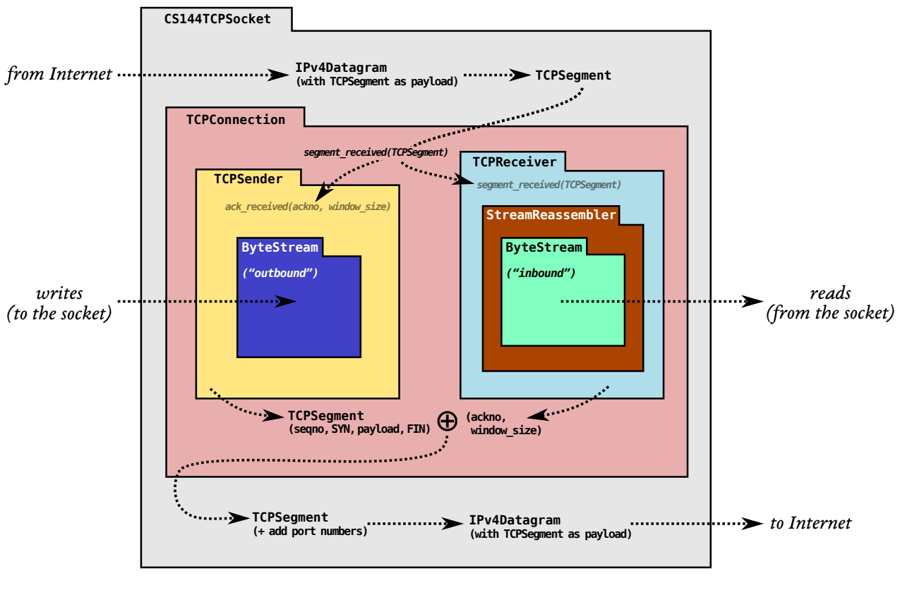
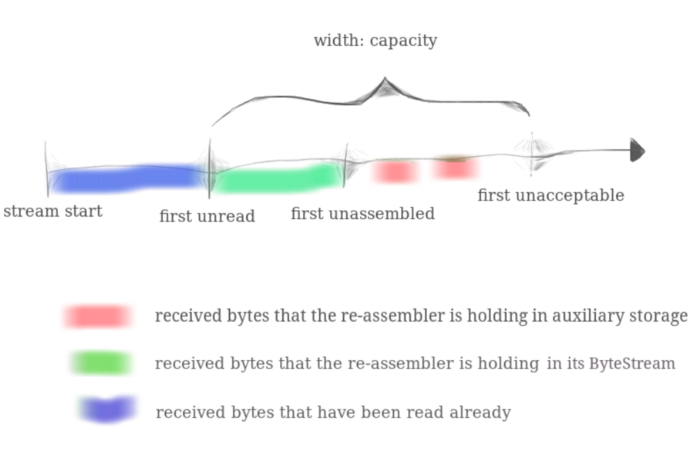

# CS 144 实验总结

课程主页：https://cs144.github.io/ 。前四个实验是实现一个用户态的 TCP 。



> 如果没学过计网，建议先看完这个视频再写 lab https://www.bilibili.com/video/BV1JV411t7ow?p=27

* 如果调试的时候没有停在断点上：

将 `etc/cflags.cmake` 第 18 行修改为如下：

set (CMAKE_CXX_FLAGS_DEBUG "${CMAKE_CXX_FLAGS_DEBUG} -ggdb3 -O0")

其实就将编译优化由 -Og 改为 -O0 。

## Lab 0

环境配置，最开始用 WSL 但是有几个测试点死活过不去，后来直接用了官网提供的镜像。

本地用 vscode remote 通过 ssh 连接。vscode 的 remote ssh 配置如下：

```
    Host vm
        HostName localhost
        Port 2222
        User cs144
```

Virtual Box 和 WSL 存在冲突，VMWare 也有冲突。使用 Virtual Box 之前需要关闭 Hyper-V，否则会出现绿屏并重启。

解决方案是关闭 Hyper-V ，以管理员方式打开 cmd/Powershell 输出 `bcdedit /set hypervisorlaunchtype off` 然后重启。

配置虚拟机的时候建议多分几个核心，编译的时候加上参数 `make -j4` 可以大大加快编译速度。其中 `-j4` 表示同时调用四个核心来编译，那么就需要分配四个核心。

### webget

手动获取网页照着流程走就行，建议提前复制下来，直接贴上去，手速慢的话就终止了。

Writing webget 则是将手动的步骤拼接为代码，通过打印输出可知：

```cpp
void get_URL(const string &host, const string &path) {
    // Your code here.
    cout << "host:  " <<  host  <<  " path: " << path << endl;
    // host:  cs144.keithw.org path: /nph-hasher/xyzzy
```

* host 是 cs144.keithw.org 
* path 是 /nph-hasher/xyzzy

```cpp
    TCPSocket socket;
    string recv;
    socket.connect(Address(host , "http"));
    socket.write("GET " + path + " HTTP/1.1\r\n" + "Host: " + host + "\r\n" + "Connection: close \r\n\r\n");
    while(socket.eof() == false){
        socket.read(recv);
        cout << recv;
    }
    socket.close();
```

实现一个内存的双向字节流。首先要明确需求，本质上是一段缓冲区，分为输入端和输出端。而容量存在上限，从输出端写入，写满后就不能再写了，从输出端读出，当读到最后一个会返回 EOF 。综上，肯定需要一个容器来存数据，选择了 `deque` 

* write: 写入的时候要考虑缓冲区满的情况，如果缓冲区满了那么就截断。
* peek_output: 读取队列前 len 个元素，len 不能超过缓冲区的范围。
* pop_output: 删除队列前 len 个元素，len 不能超过缓冲区范围。
* read：读取并弹出前 len 个元素，len 不能超过缓冲区范围。
* eof: 注意，不仅仅是缓冲区大小为零，还要保证写入结束。

这个问题首先需要考虑数据结构怎样设计。阅读函数部分思路就出来了，满足要求即可！

综上，设计出来的数据结构如下：

`libsponge\byte_stream.hh`

```cpp
  private:
    // Your code here -- add private members as necessary.
    std::deque<char> _buf{};
    size_t _capacity = 0;        // 队列当前容量
    size_t _bytes_written = 0;   // 写入长度
    size_t _bytes_read = 0;      // 读取长度
    bool _is_end_input = false;  // 写入结束
```

剩下的按照要求填坑即可。

## Lab 1 

TCP 协议需要保证数据有序，而收到的数据是无序的，所以需要经过重组变为有序。这个实验就是实现一个字符重组器 stream_reassembler ，将乱序，重叠的字符片段根据索引重组为连续的字符串并输入到 ByteStream 中。

注意 capacity = ByteStream + StreamReassembler ，由两部分组成。为方便描述前者称之为缓冲区，后者称之为重组区。故名思意，接收数据后首先经过重组区 (StreamReassembler) 根据下标进行重组，使得数据从无序变有序。然后“推入”缓冲区中(ByteStream) 而缓冲区已经在 lab0 中实现，lab1 则是实现一个重组区。



设置一个队列(buffer)，以 char 为单位，将输入的字符按照索引（index）逐个塞进去，但是存在一个问题，如果两个字符中间的数据还未到来如何表示？解决办法是同样设置一个长度的队列(bitmap)，对应位置作为标志位。如果存在数据表示 True ，否则为 False 。例如：

    index     1 2 3 4 5 6
    buffer    a a     a a
    bitmap    1 1 0 0 1 1

剩下的就是代码实现了。

`push_substring` 的输入是字符串(data)，字符串对应索引(index)以及 eof 。

首先判断是否是 eof 如果是的话需要标记一下。

接下来 index 分两种情况，index 和第一个未重组字符串索引的大小。

当 index 大于第一个未重组字符串索引之时需要判断是否需要截断。

当 index 小于第一个未重组字符串索引之时需要判断加上字符串本身长度也小于，如果小于就舍弃，因为重叠了。如果大于就切割。当然还要与剩余容量进行比较，如果大于剩余容量就截断。

注意，如果 eof 提前来了，但是前面有数据还未填入，不能将这些数据丢弃。

## Lab 2

这个实验是实现 TCPReceiver，主要负责给“对方”发送 ackno 和 window size 两件事情。ackno 表示接收者期待收到的下一个片段索引，window size 表示未组装字节索引和不可接收字节索引之间的距离。

数据通过 TCPReceiver 流向 StreamReassembler，然后是 ByteStream 最终到应用程序中。

其实就是由三部分组成：重组 + 未重组 + 未接收 ，接收窗口也就是未重组的部分。

重组数据在 lab1 中已经完成，接下来要考虑的是如何表示每一个 byte 在字节流中的位置，也就是 sequence number 。

接收到的 index 不是 64 而是 32 位，实现 32 位和 64 位之间的相互转换。循环移位，一旦达到 2^32 - 1 ，那么下一个序号将会从零开始，也就是循环移位。

tcp 的 seq 以一个随机值开始，也就是 Initial Sequence Number (ISN)。 

SYN 表示字节流开始，FIN 表示字节流终止，都占一个序号，不属于数据报本身！

ISN 代表 SYN（流的开始）的序列号。第一个字节是 ISN + 1 ，第二个字节是 ISN + 2 ，等等。

wrap 实现了 absolute seqno 到 seqno 的转换，unwrap 则是反过来。

`unwrap` 要考虑两种情况，`n - isn` 小于一个周期 `1<<32` ，所以一旦大于 checkpoint ，返回值就是 `n - isn` 。小于的情况就看 checkpoint 套了几圈，在此之前还要进行四舍五入。

`segment_received()` 首先要判断是否收到 SYN，如果是第一次收到需要设置一下状态，然后是判断是否收到 FIN，接下来是将 seqno => absolute seqno 然后将数据塞入 StreamReassembler 中进行重组。

`ackno()` 返回一个可选的 `<WrappingInt32>` ，表示接收方还未收到的第一个 seq 。注意前提是 SYN 收到，收到 SYN 需要加一，收到 FIN 还需要加一。

`window_size()` window_size 其实就是未重组的字节数。

## lab3

TCPSender 功能从收发两个角度来看：

发：TCP Sender 将 ByteStream 中的数据以 TCP segments 形式持续发送给接收者。持续发送直到窗口满，或者 Bytestream 空。

收：处理 ackno ，window size 。已经发出去但是还未收到 ack 的片段称为 outstanding ，当片段超时的时候要进行重传。

超时重传：为每个报文设置计时器，发送时启动计时器，一旦超过 RTO 就重传。RTO 随着网络环境变化。如果收到确认，则终止计时器。

只能使用 tick 来记录时间。 当还未收到 ACK 之前假定接收方的窗口值为 1 byte.

* fill_window：TCPSender 从 ByteStream 中读取数据，并以 TCPSegement 的形式发送。

将数据塞入 `_segments_out` 表示发送，塞入的同时本地还要留一个副本，目的是方便重传，逻辑结构为 `map<size_t, TCPSegment> _outgoing_map{};`。 对于那些没有有效数据，例如 ACK，FIN 等数据报不需要保留副本。

若接收方的 Windows size 为 0，则发送方将按照接收方 window size 为 1 的情况进行处理，持续发包。目的是后续一旦接收方允许接收更多的数据之时但是接收方却不知道，而将 window size 置为 1 之后，发送方可以发送数据告诉新的 windows size 值。

首先判断窗口值，其次是循环填充窗口，窗口值要大于已经发出去但是还未收到确认的字节数 (outgoing)，接下来是构造单个数据报。如果 SYN 还未发送就设置一下状态。紧接着是判断有效载荷，判断能否装下。不能装下就截断。

* ack_received()

处理从对接收方返回的 ackno 和 window size 。更新状态并丢弃已经确认但仍存于追踪队列的包。如果 window size 还未填满就继续填。

* tick() 

输入的是经过上次调用后所过去的时间并判断是否需要重传。

* send_empty_segment() 

构造一个空的 TCPSegment ，便于发送 ACK，FIN 等。

## lab4

结合前面几个lab的工作，实现一个包含 TCPSender 和 TCPReceiver 的 TCPConnection。

从函数开始下手：

* `remaining_outbound_capacity()` 计算剩余容量大小，调用 `remaining_capacity`即可。

* `bytes_in_flight()` 计算已经发出但尚未确认的数据，其实就是 `_outgoing_bytes` 。调用`TCPSender::bytes_in_flight()` 。

* `unassembled_bytes()` 尚未重组的数据，依旧是调用之前写好的接口 `TCPReceiver::unassembled_bytes()`

* `TCPConnection::inbound stream()` 读取进来的数据，其实就是调用 ByteStream 。

* `TCPConnection::connect()` 建立连接

如果是第一次调用的话，发送的第一包将会是 SYN 。`fill_window` 中已经体现，调用即可。

将 `TCPSender::segments_out` 中的数据弹出来加上当前的 ack 和 window size 并写入 `TCPConnection::_segments_out{}` 中，表示待发送的数据。至于下一步，OS 负责将数据传送给下一层，例如 UDP 。

* `TCPConnection::write()` 将数据写入出站字节流，如果可能的话，通过TCP发送。

先写入 `ByteStream` 中，然后调用 `fill_window()` 从 ByteStream 中读出。当然还需要更新当前的 ack 和 window size 。

* `TCPConnection::end_input_stream()` 关闭出站的字节流（仍然允许读取进入的数据）。

调用 `end_input()` 即可，然后发送 FIN ，最后依旧要更新当前状态。

* `TCPConnection::inbound_stream()` 从对等体收到的入站字节流。

输入的数据流入重组区(stream_reassembler)中，然后进入缓冲区。该方法是从缓冲区(byte_stream)中读取数据。

* `TCPConnection::tick()` 计时器，周期性调用，输入是自上次调用此方法以来的毫秒数

总的来看分为发送和接收两部分：

1. 站在发送的角度来看，从 write 开始，将数据写入缓冲区中，然后 fill_window 进行填充，最后更新状态。与此同时 OS 还在不断的调用 tick ，目的是告知 TCPReceiever 哪些数据已经超时，需要重传，以及已经过去的时间累计和是否需要关闭。重传次数存在上限(8)，超过后会发送 RST 。

2. 站在接收的角度来看：
   1. 重新开始计时。
   2. 收到 RST 就关闭 TCP 。
   3. 收到 ACK 就更新数据。
   4. 状态判断。
   5. keep-alive

> 这部分挺复杂。。。🥲

# 总结 

* lab0 主要实现缓冲区 ByteStream ，数据来临之后塞入。提供一些基本方法，例如缓冲区剩余容量，容量慢了后就截断之类等等。

* lab1 站在上一个实验的基础上增加了一段重组区 StreamReassembler ，实现的功能是根据索引将无序的数据转为有序然后塞入缓冲区中。用两个队列，一个队列存储数据另一个队列(bitmap)存状态(0/1)，将乱序转为有序。

* lab2 则是负责实现 TCP 接收端的功能，主要负责给发送端发送 ack 和窗口值以及索引位数的转换。其中 ack 表示下一个期待接收的数据，窗口值表示当前接受方还能处理的数据量。

* lab3 实现了 TCP 发送端的功能。实现 fill_window ， tick 和 ack_receivs 三个函数。

其中 fill_window 函数不断的填充窗口。除此之外还负责发送 SYN 和 FIN 前者用于建立连接后者用于终止连接。fill_window 发送的每一份数据都要备份，当数据丢失时可以取出重传。

tick 不断被 OS 调用，根据时间判断是否需要重传，

ack_received 处理接收端发送来的 ackno 和窗口值。根据 ackno 将不需要的备份数据删除。然后清空超时时间，最后更新重传次数和当前窗口值。

* lab4 实现 TCPConnection ，将发送端和接收端结合从而实现一个 TCP 终端。

segment_received() 输入的是接收到数据。接收数据分三种情况，第一次接收数据，也就是第一次握手接收端的请情况，其次是正常接收数据，然后是最后一次接收数据的情况。具体流程是首先判断 ast ，接下来判断服务端第一次握手的情况，若是就发送数据填充窗口，并更新信息。接下里处理断开连接的情况，需要等待一段时间保证服务端确保客户端已经完全接收到信息了。

* ack_received()

处理从对接收方返回的 ackno 和 window size 。更新状态并丢弃已经确认但仍存于追踪队列的包。如果 window size 还未填满就继续填。