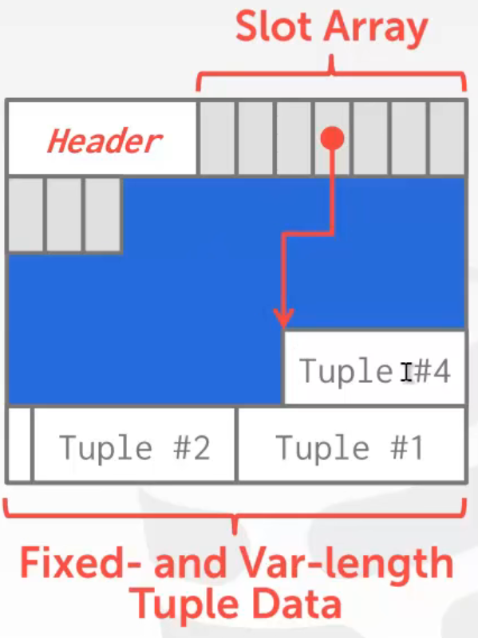

> 这篇文章主要介绍一下每部分的功能以及怎么实现的文字版伪码，不涉及具体代码。

# 6.830 Database Systems Spring 2021

课程主页：http://dsg.csail.mit.edu/6.830/

顺便把实验手册翻译了一遍，都在这个[仓库](https://github.com/weijiew/codestep)里面。

# lab1

> Tuple/HeapFile等基础设施

TupleDesc 是表头，其中 fieldName 和 fieldType 为每一列的名字和类型，有多列组成。

Tuple 表示一行数据，二者组成了一张二维表。在一张表格中，由一行 TupleDesc 和多行 Tuple 组成。

Catalog 表目录，其中是一个表集合，最终将会实现从磁盘中读取表的功能。

Catalog 中维护了一个 Table 类（类似 TDItem），内部包含 file，name，pkeyField 三个字段，用容器来存 Table 。

实现 `storage/BufferPool.java` 中的 `getPage()` 方法和构造方法。`getPage()` 首先先去 pid 判断是否已经缓存，如果没有缓存再去硬盘（DbFile）中加载，加载后依旧缓存一下。

DbFile 接口实现了和磁盘读写之间的读写 page ，插入删除 tuple 等功能。

DbFile 和 table 是一一对应的，而 HeapFile 是 DbFile 的一种实现。除此之外还有 B-trees 实现。

一个 HeapFile 中存了一个 Page 集合，HeapPage 是 Page 的一种实现，其中每一个 page 都存有固定数量的 tuple 。

HeapFile 中的每一页(page)都有一组槽(slot)，每一个 slot 中“嵌入”一个 tuple 。此外，每一个 page 除了 slot 之外还有 head 部分，head 部分用来存 page 中的 slot 是否被使用。

统计一个 page 中的 tuple 数量：`_tuples per page_ = floor((_page size_ * 8) / (_tuple size_ * 8 + 1)) ` 。

其中 `_page size_ * 8` 表示一页需要多少二进制位，`_tuple size_ * 8 + 1` 表示一个 tuple 占多少二进制位，除此之外，一个 tuple 存在与否也占一个二进制位，所以加一。二者做除法就是一页上可以存放多少 tuple 。

读取 page 时首先要确定偏移值（页数乘单页大小），然后初始化一张空 page ，最后根据偏移值将空 page 填满。 

总结：Catalog 中有多个 table，一个 table 对应一个 DbFile ，HeapFile 中存了多个 Page，一个 Page 中有一个 head 和多个 slot ，一个 slot 存一个 tuple。

一个查询流程：

1. 创建一个 TupleDesc 对象，里面包含了三个整数类型的字段及其文件名。
2. 然后初始化 `HeapFile` 加载数据源 `some_data_file.dat` 生成 Table 。将 Table 加入到 Catalog 中。
3. 完成数据库系统的初始化后，接下来创建一个查询计划。该计划由`SeqScan`操作符组成，从磁盘上扫描 tuple 然后在命令行中输出。

# lab2

1. 为 Buffer Pool 增加 LRU 页面置换功能。

2. 实现 Filter 和 Join ，已经提供了 Project 和 OrderBy 的实现。

其中 Filter 用于过滤，判断输入的 tuple 是否符合预期。里面构造一个 `Predicate` 对象，也就是一个判断条件，其中输入的三个参数分别是 tuple 中待比较字段的下标，比较符和待比较的数。其中 `fetchNext()` 方法逐个读取 OpIterator 中的 Tuple ，然后让他们与 Predicate 中 Field 进行比较，如果为真则返回该 Tuple。

然后是 Join 功能是遍历两个表中的 tuple ，从中取出符合条件的字段拼成新的表。首先实现 JoinPredicate ，用于比较两个 Tuple 。其中 fetchNext 中由两个 while 循环进行遍历，每次遍历 child1 取出一个 Tuple ，与 child2 中的所有 Tuple 做比较判断是否符合要求，然后创建新的 TupleDesc ，将 child1 和 child2 的字段（field），加入newTuple中，最后返回newTuple，同时将 child2 重置到最开始。

3. 实现单个字段的聚合(aggregation)和单个字段的分组(group by)即可。

实现 StringAggregator 和 IntegerAggregator 。编写计算一个特定字段在输入 tuple 序列的多个组中的聚合。聚合其实就对一组数据进行操作（加减乘除，最值等）。

因为只有整数和字符串，所以计算平均数时使用整数除法。而字符串只需要支持 COUNT 聚合即可。

分组(group by) 首先指定分组的字段位置，当然也可以不分组，然后输入待聚合的字段，最后输入聚合的操作符以及数据类型执行聚合操作。

4. 增加 tuple 或删除 tuple 。实现 `Insert` 和 `Delete` 操作符。

首先判断待删除 tuple 的 RecordId 是否被使用，如果被使用就比较当前的 tuple 和待删除的 tuple 对象，一致就删除并标记。

`insertTuple()` 取一个空白页面，首先判断 BufferPool 有无，如果没有就调用 writePage 在磁盘中创建空页。然后去 BufferPool 取页，接下来判断取到的页中是否含有空 slot ，然后插入 tuple 。

`deleteTuple()` 从 BufferPool 中取出 page 然后删除 tuple 。

# Lab 3: Query Optimization

这个 lab 大致要实现的东西：

1. 为字段构建一张直方图，计算字段的最大值最小值均分不同区域，统计对应区域内 tuple 数量。

计算单个桶的占比 `(h / w) / ntups`  其中 h 是桶中 tuple 总数，假设均匀分布。 ntups 是纵坐标的累加和，也就是 tuple 的总数。

部分区间的占比 ：`b_part =（b_right - const）/ w_b` `b_f = h_b / ntups` `b_f x b_part`

2. 根据 tableid 拿到 table，然后遍历 table 的每个字段(field)构建直方图。使用直方图来估计过滤器的选择性和扫描的成本。

首先获取每一列对应的内容，放入 list 中。然后获取所有列的内容，一列就是一个 field ，一列生成一个直方图。

IO 成本是 table 的页数乘上单页 IO 的开销。

选择性：tuple 总数乘上系数 (selectivityFactor)。

3. 实现 JoinOptimizer 类中的方法，使其能够估计 join 的成本和选择性。

估计 join 的成本，`estimateJoinCost()` 方法，计算公式：

  joincost(t1 join t2) = scancost(t1) + ntups(t1) x scancost(t2) //IO cost
                      + ntups(t1) x ntups(t2)  //CPU cost

Join 采用了 Nested-loop (NL) join 。当两张表进行关联查询的时候，通常查询的第一张表叫做驱动表，第二张表叫做被驱动表。通过查询驱动表得到的结果和被驱动表关联。通常选择查询结果集小的表作为驱动表。具体执行流程是两层 for 循环，外层循环是驱动表，内层循环是被驱动表，将满足条件的数据返回。

成本 (cost) 分为 I/O 成本和 CPU 成本。I/O 成本是扫描表时和磁盘交互所产生的，而 CPU 成本是判断数据是否符合条件所产生的。其中 cost1 是扫描 t1 的 I/O 成本，cost2 同理。因为是 NL join 所以总的 I/O 开销就是 `cost1 + card1 * cost2` 。而 CPU 开销则是 `card1 * card2` 。总成本相加即可。

4. 从一系列的连接中选择一个最佳的顺序(Selinger)。

根据不同连接顺序的开销来确定最优的连接顺序。而连接顺序如果枚举的话复杂度是阶乘级别，此处选择 Selinger 基于 DP 能够优化到指数级别。

Selinger 的前提是 [left-deep-tree](https://www.infoq.cn/article/JCJyMrGDQHl8osMFQ7ZR) ，要求所有的右子树必须是一个实体表。而左子树只有第一个是实体表，后续的都是生成的中间表。

JoinOptimizer 中的 join 属性是一个队列，其中存的都是 LogicalJoinNode 对象。

PlanCache 类，用来缓存 Selinger 实现中所考虑的连接子集的最佳顺序，接下来的任务就是找到最佳顺序。

* 首先遍历不同长度连接长度下的开销：
  1. 计算长度为 1 也就是，枚举 a b c d e 的 seq scan 开销。
  2. 枚举长度为 2 的组合，计算 ab ba ，cd dc，ac ca ... 的开销。注意 a/b/c/d/e 之前已经计算过了。
  3. 枚举长度为 3 的组合，长度为 2 的组合已经计算过了，然后再加一个进行枚举。

这个 [pdf](https://ocw.mit.edu/courses/electrical-engineering-and-computer-science/6-830-database-systems-fall-2010/lecture-notes/MIT6_830F10_lec09_selinger.pdf) 中有一个例子，建议好好看看。

# Lab 4: SimpleDB Transactions

Transactions 被翻译为事物，其实就是一个原子级的操作，重点是操作不能被中断。用锁来实现原子级别的操作，但是单纯用锁的话存在串行化的问题，于是引入了 2PL 从而保证了串行化。

在 2PL 下，事物分为增长阶段 (growing phase) 和收缩阶段 (shrinking phase) ，区别在于前者只能不断加锁，而后者只能不断减锁，一旦开始减锁就意味着从增长阶段转为收缩阶段。

NO STEAL/STEAL: 在事务提交前就写入磁盘的情况称之为 steal 策略（意思是在事务提交前，缓存中的一个行数据page被偷走了写入磁盘），相反，在事务提交前行数据绝不会写入磁盘的称之为no steal策略。

FORCE/NO FORCE: force 刷新策略表示在事务提交那一刻写入稳定存储中，但是这个会严重影响性能（产生很多小的磁盘随机io和写放大）。因此现实中的数据库大多使用no-force策略（即事务提交的时候不会强制刷新行数据缓冲page到磁盘）。

此处对于缓冲区要实现的是 NO STEAL/FORCE ，也就是在事物提交之前缓存中的数据不写入磁盘，而事务一旦提交立即将脏页写入磁盘。

## ex1 ex2 

为 BufferPool 添加获取锁和释放锁的功能，修改 getPage() 实现 unsafeReleasePage(), holdsLock() 实现下一个练习才能通过 LockingTest 。

具体思路，实现一个 Lock 类和 LockManager 类。LockManager 类实现三个功能申请锁、释放锁、查看指定数据页的指定事务是否有锁。

getPage() 表示从磁盘中读取一个 Page 。首先根据输入的参数获取当前操作是读还是写，进而确定上锁的类型，然后执行 LRU 获取相应的页。

获取锁首先分析待操作的页面是不是已经被上锁了？如果没有锁，那么直接上锁。

否则要遍历该页面下的锁，共有三种情况：
1. 如果之前拿过该锁并且和此次申请的锁类型是一样的那么直接返回 true 表示申请成功。
2. 如果此前已经拿到写锁了，那么接下里不论是申请读锁还是写锁都直接返回 true ，因为写锁的优先级大于读锁。
3. 最后是如果此前有读锁，但是当前想要写锁并且锁队列中只有一个锁，那么该锁可以升级为写锁。

锁管理器中的核心数据结构是，每一个页表中都对应一个锁列表。

## ex3

之前没有区分是否是脏页就直接写回了，不能将脏页直接淘汰。

修改 evictPage() 方法，倒着遍历，删除一个非脏页即可。

## ex4

实现 `transactionComplete()` 事务提交时会调用该方法。

如果 commit 那么就把 tid 对应的所有页面持久化，也就是写入磁盘否则把该事物相关的页面加载进缓存中。否则就从磁盘中重新加载指定事务的所有页面。

## ex5 

死锁处理：设置一个死循环，如果超过一定的时间依旧没有结果就返回死锁。

# lab5

## Exercise 1: BTreeFile.findLeafPage()

实现 findLeafPage() 功能是给定一个特定的键值的情况下找到合适的叶子页。

具体流程如下图：根节点是 6 是一个内部页，两个指针分别指向了叶子页。如果输入 1 那么 findLeafPage() 应当返回第一个叶子页。如果输入 8 那么应当返回第二个叶子页。如果输入 6 此时左右叶子页都含有 6 ，函数应当返回第一个叶子页，也就是左边的叶子页。

实现 findLeafPage 函数，这是一个递归函数。具体来说就递归查找一个值，需要区分页类型。

首先分析待查找页的类型，共有四种类型，分别是：根页(ROOT_PTR)，内部页(INTERNAL)，叶子页(LEAF)，标题页(HEADER)。其中标题页(HEADER)用于跟踪文件中的哪些页正在使用，

如果是叶子节点直接返回，输出页信息，也就是递归出口。

如果是内部页，需要遍历该页中的所有 entry ，一旦发现小于等于当前字段，那么直接去左孩子节点中查找，否则等待遍历完成后递归到右孩子节点上。

## Exercise 2: Splitting Pages

在 BTreeFile.java 中实现 splitLeafPage() 和 splitInternalPage() 

通过 findLeafPage() 可以找到应该插入 tuple 的正确叶子页，但是页满的情况下插入 tuple 可能会导致页分裂，进而导致父节点分裂也就是递归分裂。而 splitLeafPage() 的功能就是分割叶子页并递归的分割父节点进而容纳一个新的 entry 。

具体实现流程是：首先创建一张空页，将数据拆分倒着遍历放到该页上。因为是叶子节点拆分，新的节点的右指针需要指向右兄弟。然后处理父节点的指针。

splitInternalPage() 是拆分内部页。

在 splitLeafPage() 中将键“复制”到父页上，页节点中保留一份。而在 splitInternalPage() 中，你应该将键“推”到父页上，内部节点不保留。

## Exercise 3: Redistributing pages

实现 BTreeFile.stealFromLeafPage(), BTreeFile.stealFromLeftInternalPage(), BTreeFile.stealFromRightInternalPage() 

删除存在两种情况，如果兄弟节点数据比较多可以从兄弟节点借，反之数据较少可以和兄弟节点合并。

stealFromLeafPage() 两个页面 tuple 加一起然后除二，平均分成两个 leaf page 。

## Exercise 4: Merging pages

实现 BTreeFile.mergeLeafPages() 和 BTreeFile.mergeInternalPages() 。

BTreeFile.mergeLeafPages() 合并两个叶子节点。

BTreeFile.mergeInternalPages() 合并两个内部节点。

# Lab 6: Rollback and Recovery

根据日志内容实现 rollback 和 recovery 。

当读取 page 时，代码会记住 page 中的原始内容作为 before-image 。 当事务更新 page 时，修改后的 page 作为 after-image 。使用 before-image 在 aborts 进行 rollback 并在 recovery 期间撤销失败的事务。

redo log 是用来对已提交的事务做恢复，undo log 是用来对未提交的事务做回滚。 

在 redo log 中记录当前每一步的操作，在 undo log 中记录回滚到上一步的操作。

flushPage() 方法表示将页写入磁盘中，增加写入日志的操作，每当向磁盘中写入页面的时候需要将记录写入日志中。
<<<<<<< HEAD

日志格式：事务失败(ABORT), 事务提交(COMMIT), 写入脏页(UPDATE), 事务开始(BEGIN), 和检测点(CHECKPOINT)这些格式的日志都记录在同一个日志文件中；

其中 UPDATE 格式的记录，有两部分组成，即before image和after image，分别记录修改前和修改后的日志。回滚的时候会用到 before image ，事务提交成功但数据由于故障丢失数据我们会用到after image。

对于CHECKPOINT 记录，主要记录在checkpoint点活跃的事务数，以及每个事务的的事务id和第一条日志记录的偏移量。在此之前的日志是已经写入磁盘的，而在此之后的则是可能存在问题的，也就是只能持久到日志没有真正执行到磁盘的。因此崩溃的时候从 checkpoint 开始往后读，然后根据日志记录进行恢复。

=======

日志格式：事务失败(ABORT), 事务提交(COMMIT), 写入脏页(UPDATE), 事务开始(BEGIN), 和检测点(CHECKPOINT)这些格式的日志都记录在同一个日志文件中；

其中 UPDATE 格式的记录，有两部分组成，即before image和after image，分别记录修改前和修改后的日志。回滚的时候会用到 before image ，事务提交成功但数据由于故障丢失数据我们会用到after image。

对于CHECKPOINT 记录，主要记录在checkpoint点活跃的事务数，以及每个事务的的事务id和第一条日志记录的偏移量。在此之前的日志是已经写入磁盘的，而在此之后的则是可能存在问题的，也就是只能持久到日志没有真正执行到磁盘的。因此崩溃的时候从 checkpoint 开始往后读，然后根据日志记录进行恢复。

>>>>>>> 7bf52420e1b5ab0ec51771b1fb4b2870e2d352d9
## Exercise 1: LogFile.rollback()

实现LogFile.java中的rollback()函数，rollback() 回滚指定事务，已经提交了的事务上不能执行该方法。将上一个版本的数据写回磁盘。

当一个事务中止时，在该事务释放其锁之前，这个函数被调用。它的工作是解除事务可能对数据库做出的任何改变。

对日志中的所有 UPDATE 都执行 undo 操作。

首先获取该事务第一条记录的位置。然后移动到开始的位置，然后搜集发生的修改的 page 最后写入磁盘。

## Exercise 2: LogFile.recover()

实现 Implement LogFile.recover()。重启数据库时会率先调用 LogFile.recover() 

<<<<<<< HEAD
对于未提交的事务：使用before-image对其进行恢复，对于已提交的事务：使用after-image对其进行恢复。

=======
对于未提交的事务：使用before-image对其进行恢复，对于已提交的事务：使用after-image对其进行恢复。
>>>>>>> 7bf52420e1b5ab0ec51771b1fb4b2870e2d352d9
