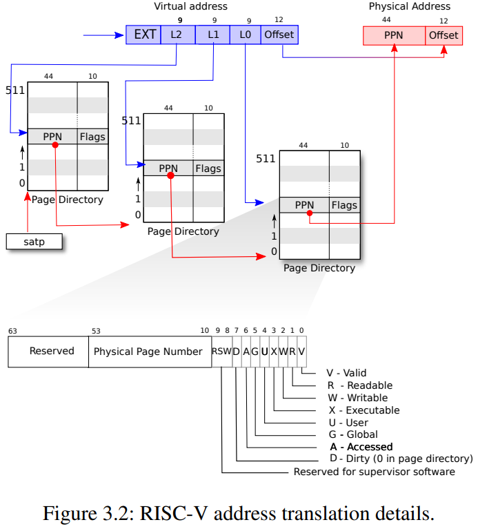
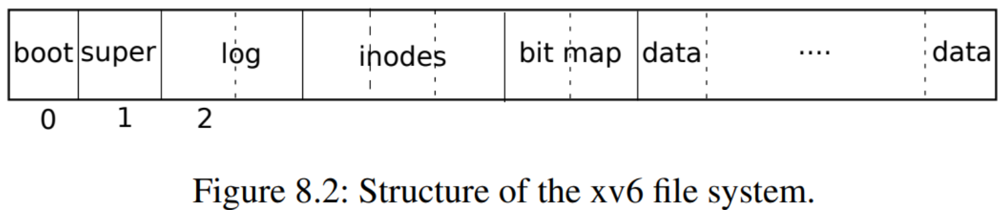

# 总结

终于把十一个实验写完了，下面是实验的简要总结。结合着代码看确实比单纯背概念好很多。

想用 Rust 重写，现在彻底没时间了。等找到工作后一定要把这个重写一遍。

## Lab1 Unix utilities

实现一些用户态下的程序，例如 sleep，xargs 等，主要是熟悉系统调用。

## Lab2 System calls

系统调用从用户态到内核态的切换流程：

### 1. System call tracing (moderate)

目的：实现一个函数(trace)，该函数输出程序在执行过程中需要使用到的系统调用，然后将系统调用的进程ID、系统调用的名称和返回值，包含子进程的信息其打印出来！

如何指定系统调用？每一个系统对应一个掩码，可以在文件 kernel/syscall.h 中查询。需要输入一个掩码，这个掩码的二进制的不同位描述的要打印的系统调用信息。然后根据输入的掩码识别到相应的系统调用，可以一次打印多个。

在描述进程的结构体中加上掩码字段，用于跟踪待打印的进程。执行 trace 函数的时候输入掩码，进而跳转到内核态实现掩码的绑定。

所有的系统调用都要经过 syscall 函数，加一个 if 语句，根据掩码值确定是否是待打印的系统调用，从而打印相应的信息。

### 2. Sysinfo (moderate)

添加系统调用函数 sysinfo 返回空闲的内存、以及已创建的进程数量。

首先使其编译通过。

1. 首先在 Makefile 添加内容使得编译的时候能够识别。
2. 在 user/user.h 中添加对应的函数声明使得能够识别到。
3. Makefile 通过编译 user/usys.pl 生成相应的汇编文件，通过汇编文件过渡到内核态。(Makefile => `user/usys.pl` => `user/usys.S`)
4. 在 kernel/syscall.c 跟新相应内容方便根据汇编跳转到指定的系统调用上。

如何获取内存？

在 xv6 中，空闲内存是以链表的形式存在，形成了一个空闲页链表

> 常见的记录空闲页的方法有：空闲表法、空闲链表法、位示图法（位图法）、成组链接法。

遍历内存(kmem)的空闲页链表(freelist)，统计空闲页的个数。记得加锁去锁。

如何获得运行的进程数？

遍历进程的结构体数组(所有进程都在一个数组中)，统计所有状态(state)不是 UNUSED 的进程。

## Lab3 Page tables

探索页表，修改页表以简化从用户态拷贝数据到内核态的方法。

### 1. Print a page table (easy)

如何打印页表中的内容？

首先需要了解虚拟地址，三级页表，寻址方式：

首先要区分虚拟地址和物理地址，物理地址可以直接索引硬件，而虚拟地址通过页表建立的映射可以转换为虚拟地址。

那么虚拟地址有什么作用？加快索引，隔离，

虚拟地址的组成？虚拟地址一共 64 位，在 Risc-V 中，高 25 位使用，只使用低 39 位。而低 39 位又分为两部分，其中高 27 位用于索引到具体的页，而低 12 位用于索引页内的具体地址。从侧面也反应了页大小为 4096 字节 (`2^12 = 4096`) 。

接下来分析 27 位的组成，27 分为三部分，每一部分都是 9 位，L1，L2，L3 分别对应三张页表的业内偏移地址。 `2^9 = 512` 所以每一页共又 512 个 PTE 组成。

每个 PTE 中 44 + 10 ，后 10 个是标志位，前 44 个是下一个页表项的起始地址。根据加上虚拟地址中第二个 9 位的索引找到第三个。

一级页表的起始地址存于 stap 中，据此可获得一级页表的地址。

页表查询流程：根据 stap + L1 可以获得一级页表对应的 PTE ，查询 PTE 中的 PPN 可以获得二级页表的起始地址，这个起始地址加上 L2(二级页表的业内偏移地址) 可得相应的 PTE，查询 PTE 中的 PPN 可得三级页表的起始地址。根据 L3 可得三级页表的业内偏移，从而拿到对应的 PTE 。取出 PPN 得到真正的物理地址。

通过遍历一级页表，打印出来所有内容。

### 2. A kernel page table per process (hard)

* 如何为每个进程实现单独的内核页表？

在此之前用户页表是独享的，而内核页表的全局共享的。现在要为每个进程增加独享的内核页表。

在描述进程的结构体中增加内核页表的字段。做一些内核页表初始化的工作，内核页表需要依赖一些映射才能工作。例如 UART 控制、硬盘界面、中断控制等。也就是实现一个用于创建内核页表的函数。

* 如何处理内核栈？

接下来处理内核栈，此前因为内核页表是共享的所以内核栈也是共享的。

而目前改为了独立的内核页表，因为存在多核同时处于内核态的情况，所以需要分配独立的内核栈。最终实现每个进程可以访问属于自己独立的内核栈。

将内核页表映射到一个固定的位置，创建进程的时候初始化内核栈。

在 scheduler 函数从全局的内核页表切换到进程的内核栈中。

释放内核页表，仅仅消除页表中内容即可。不用消除对应物理地址的内容。

### 3. Simplify copyin/copyinstr (hard)

修改页表以简化从用户态拷贝数据到内核态的方法。

进程的内核页表维护用户态页表副本使得在内核态下也能访问用户进程的内容。在内核态下是直接映射，在用户态下需要经过查表得过程，当读取文件的时候可以直接切换为内核态，通过用户态页表副本读取相应数据从而达到加速读取的目的。

首先实现一个支持页面拷贝的函数和消除页表映射的函数。

fork(),exec(),growproc(),userinit() 三个函数都要处理新建和消除的映射。

## Lab4 Traps

探索 trap 实现系统调用的方式。主要是理解概念。

### 1. Backtrace (moderate)

打印出调用栈的信息。需要理解函数栈的结构。

首先要了解进程的内存布局。

进程地址从零开始，首先是指令，然后是全局变量，然后是栈区，最后是一个堆区域。xv6 为 trampoline（用于在用户和内核之间切换）和映射进程切换到内核的trapframe分别保留了一个页面，

这个实验用到了栈区。也就是函数调用的时候要进行相应的压栈操作，然后在栈中分配相应的变量。

在栈中栈指针 sp (stack pointer)。 指向栈的最高处。栈帧指针 fp (frame pointer)。指向栈帧(stack frame)的最高处。

可以简单的理解为 sp 是当前函数在栈中地址上界，而 fp 则是当前具体执行到那一步了。

fp - 8 表示返回地址，fp - 16 表示上一个 fp 的地址。

打印 fp - 8 中的内容，然后根据 fp - 16 找到找到上一个栈，然后循环。

### 2. Alarm (hard)

实现一个进程使用 CPU time 时周期性的发出警告的功能。例如周期性的检查中断/异常需要用到这个功能。

增加一个系统调用 sigalarm(interval, handler)，其中 handler 是一个函数，interval 一个整数表示经过的时间。sigalarm 的功能是经过 interval 个 CPU ticks ，调用 handler 函数。如果 sigalarm(0, 0) 内核将会停止周期性调用。

在 usertrap 实现具体的执行逻辑，每次发生时钟中断时都会调用该逻辑。

## Lab5 Lazy allocation

在调用 sbrk() 的时候，不立即分配内存，而是只作记录。当访问到的时候才去进行分配。

修改 sys_sbrk，只是修改 sz 字段，不做内存分配。

捕捉异常，当发生缺页错误 13 / 15 并且发生缺页异常才进行分配相应的物理内存并在页表中建立相应的映射。。

如何检测因为懒加载导致的缺页异常？首先要小于 sz，其次不应该是保护页，最后是页表项不存在。

copyin() 和 copyout()：内核/用户态之间互相拷贝数据，可能访问到需要建立映射的页。

## Lab6 Copy-on-write fork

fork 之后不立即复制相同部分的内容。而是等待真正要用的时候才去复制。对于存在读写差异的等待真正要用的时候才去处理。添加一个标志位(COW)用于识别物理页是否进行懒加载。父子共享页的部分改为只读。

在 fork 的时候不立即复制数据只建立映射+标记，在进程尝试写入的时候进行实复制并重新映射为可写。

识别 COW 的场景，首先是发生缺页异常，其次是 sz 的范围，然后判断标志位 COW 。

接下来是处理 COW，将待处理的物理页复制到新的物理页行，权限改为可写。然后建立新的映射。

## Lab7 Multithreading

实现一个用户态的线程库；尝试使用线程来为程序提速；并且尝试实现一个同步屏障

### Uthread: switching between threads (moderate)

借助 swtch.S 上下文寄切换。在进程中创建上下文切换需要保存的用于描述寄存器值的结构体。在线程的结构体中增加 context 字段。

然后修改 thread_schedule 函数执行切换线程 thread_switch 的操作。

设置 ra 指向相应的函数，设置 sp 使得线程拥有自己的栈并指向 ra 对应的函数。

### Using threads (moderate)

put 的时候可能会导致数据丢失，加锁就完事的了。

### Barrier (moderate)

记录当前已经来临的线程，如果线程达到上限就唤醒所有线程然后释放锁，反之则使来临的线程沉睡，醒来后重新获取锁。

## Lab8 Parallelism/Locking

重新设计代码以降低锁竞争，提高多核机器上系统的并行性。

锁优化的两个思路：

1. 能不共享就不共享。
2. 非得共享就尽可能的降低锁的粒度。

### Memory allocator(moderate)

此前从空闲链表中申请内存的时候是直接加一把锁导致锁竞争很严重。从能不共享就不共享的角度来处理，可以将其改为为每个 CPU 分配独立的 freelist 从而支持多个 CPU 同时申请内存，也就是并发。也就是数组加链表的结构。

除此之外可能存在某个 CPU 申请过猛的情况，也就是 freelist 不够用了，此时可以从别的 CPU 对应的 freelist 中借。借有两种策略，一种是对着一个 CPU 猛地来一口，一种是均匀的收割。我选择了后者，但是均匀收割的次数也需要调整。

1. 首先根据 dev 和 blockno 生成对应索引，查看对应桶中的是否存在 blockno 。
2. 如果存在直接返回。
3. 如果不存在就选择 LRU 节点删除。
4. 取出每一个桶中的 LRU 节点(加锁)，遍历所有桶，寻找使用次数最少的节点驱逐。
5. 然后根据 key 将待查找的节点加入桶中。

### Buffer cache (hard)

对于缓存就不一样了，存在很多问题。

之前一个 CPU 可以独占一个空闲页链表，但是此处的一份缓存可以被多分读写，所以存在很多问题。除此之外还有页面置换所带来的一些问题。

此前是将一整个 Buffer cache 链表加锁。可以改为数组加链表，当两个进程同时访问数组的同一个位置时才加锁，这样可以细化锁的粒度，从而降低并发。

换成数组加链表：

1. 首先根据 dev 和 blockno 生成对应索引，查看对应桶中的是否存在 blockno 。
2. 如果存在直接返回。
3. 如果不存在就选择 LRU 节点删除。
4. 取出每一个桶中的 LRU 节点(加锁)，遍历所有桶，寻找使用次数最少的节点驱逐。
5. 然后根据 key 将待查找的节点加入桶中。

存在的问题：

在多线程场景下，如果对单个链表加锁，去锁后不能保证之前取得的 LRU 节点依旧有效，因为在去锁后有可能别的节点调用该节点使得 LRU 节点更改。

解决方案：

在遍历桶的时候，如果桶中没有节点不可能成为 LRU 节点则直接释放锁，反之锁不释放始终保持。也就是之前锁的策略粒度太小出问题了，需要加大粒度。

存在的问题：

接下来是死锁的问题，两个进程同时保持并申请对方的资源时会导致死锁。上一个方案加大了锁的粒度进而导致了存在死锁的可能。

死锁的四个条件：

1. 互斥（一个资源在任何时候只能属于一个线程）
2. 请求保持（线程在拿着一个锁的情况下，去申请另一个锁）
3. 不剥夺（外力不强制剥夺一个线程已经拥有的资源）
4. 环路等待（请求资源的顺序形成了一个环）

可以通过释放待查找桶的锁来解决问题。但是存在多个进程同时申请获得多分缓存的情况。

可以将驱逐+重分配的过程限制为单线程。也就是乐观锁。

bget 的功能是，如果带查找的节点在缓存中那么直接返回，反之驱逐 LRU 节点。

## Lab9 File System

为 xv6 的文件系统添加大文件以及符号链接支持。

### XV6 的文件结构

首先需要考虑磁盘的组成，站在文件系统的角度来看，磁盘可以看成一个字节数组，由 block 组成。

在 xv6 中一个 block 是 1024 字节，其中又由 2 个 sector 组成，那么一个 sector 就是 512 字节。

从数组的角度来看，整个磁盘可看成由 block 组成的数组。 

1. block0 被称为 boot block 其中要么不使用，要么存储的是启动 OS 的代码，通过这些程序使得 OS 代码能够加载到内存中。
2. block1 被称为 super block 其中中存储的是一些元数据，例如文件系统大小，数据块数量，inode 的数量。通过mkdfs 将该块写入，然后通过该块建立起初始的文件系统。
3. block2-31 被称为 log block  中存储的是日志信息，用来做崩溃恢复之类的工作。
4. block32 到 45 中存储的是 inode。一个 inode 是 64 byte，而一个 block 是 1024 byte，所以每个 block 中存储了多个 inode。inode 用来表示一个文件的元数据，代表一个文件对象，所以一个 inode 就是一个文件。通过一个整数来唯一标识一个文件，而非文件名。
   1. 其中 type 字段表明inode是文件还是目录。
   2. nlink 字段，也就是link计数器，用来跟踪究竟有多少文件名指向了当前的inode。
   3. size字段，表明了文件数据有多少个字节。
   4. bn0 到 bn11，12 个指向 block 的指针，block 用来直接存数据。
   5. bn12 也是指向 block 但这是一个二级索引，指向的 block 中存其他 block 的地址。其中一个索引是 4 字节，所以一共指向了 256 个 block 。所以空间上限是 (12 + 256)*1024 。
   6. 如果用来表示目录，目录由 entry 组成。前两个字节表示 inode 序号，后 14 个字节表示文件名。
      1. 例如根目录(`/`)的 inode 在编号 1 中，也就是 block32 的 64B 到 128B 中。
      2. 如果查找其他目录，例如目录 `/y` ，从 inode1 的 bn0 中开始扫描，如果找到文件中会包含 inode 编号，然后读取相应编号查看相应的 block 。
      3. 如果查看 `/y/x` 则从存储 `/y` indoe 编号开始继续从 bn0 开始遍历，直到找到 `/y/x` 对应的 indoe 编号。
5. block45 中存储的是 bitmap ，只占据一个block，用来判断数据块是否空闲，0 表示空闲，1 反之。
6. block46 之后就都是数据块了。

通常 log，inode，bitmap 被称为元数据块。

### XV6 创建一个文件所经过的流程

分析 `echo “hi” > x` 执行流程：

1. 创建文件
   1. write 33 通过修改 inode 中的 type 字段表示将要被使用，这个字段同时也表示 inode 是文件还是目录。inode的type从空闲改成了文件，并写入磁盘表示这个inode已经被使用了
   2. write 33 实际写入 inode 的内容。inode 的内容会包含 linkcount 为 1 以及其他内容。
   3. write 46 向第一个 data block 写数据，这个 data block 属于根目录并且是根目录的第一个 block 。添加 x 的 entry 到根目录的 block 中。
   4. write 32 block 32 保存的仍然是inode。更新了根目录的大小，因为我们刚刚添加了 16 个字节的 entry 来代表文件 x 的信息。
   5. write 33 再次更新了文件 x 的 inode ，尽管还没有写入任何数据。
2. 将 "hi" 写入文件
   1. write 45 更新 bitmap 。通过扫描bitmap来找到一个还没有使用的data block将对应的bit设置为1。
   2. write 595 两次调用表明，文件系统挑选了data block 595。x 的 inode 中第一个direct block number是595。因为写入了两个字符，所以write 595被调用了两次。
   3. write 33 更新inode的size，direct block number(595)，字段。因为现在文件 x 中有了两个字符。
3. 将 "\n" 写入文件
   1. write 595
   2. write 33

### Large files(moderate)

bigfile 将会创建一个包含 65803 个块的文件，但未修改的 xv6 将文件限制为 268 个块。

为了支持 65803 个块，目前一共 12 + 1 ，12 是直接地址，1 是间接地址。将 1 指向的块在此拆分变成二级间接块，即 256*256。

12 中再拆出一个间接块就够了，即 `256*256+256+11 = 65803` 。

读懂 fs.c 中的 bmap() 。

ip->addrs[]的前11个元素应该是直接块；第12个应该是一个一级间接块（与当前的一样）；13号应该是你的新二级间接块。

### Symbolic links(moderate)

支持软连接，也就是为文件创建一个新名称。

`symlink(char *target, char *path)` 例如 symlink("x/y","x/z"); 为文件 `x/y` 创建 `x/z` 的文件名。

本质上是为 path 创建 inode ，将 target 写入 path 创建的 inode 中。

通过 sys_open 来创建文件， open 有两个参数，第一个参数是 path 表示文件的路径，第二个参数是 omode 表示权限，表示可读/可写/可执行。

sys_open 打开文件，需要处理递归遇到符号链接的情况。

## Lab10 Mmap

支持将文件映射到一片用户虚拟内存区域内，并且支持将对其的修改写回磁盘。

确定映射位置，在 trapframe 和 heap 之间。接下来定义 vma 结构体，其中包含了 mmap 映射的内存区域的各种必要信息，比如开始地址、大小、所映射文件、文件内偏移以及权限等。创建 16 个 vma 槽。

建立映射，遍历 vma 槽寻找可用的，初始化，设置相关信息。注意增加文件的引用计数。

实行 lazy 策略，usertrap 捕捉相应的逻辑(lab5)，然后读取文件并建立相关的映射。

mmap 的优势，普通的文件操作需要经历磁盘到缓存，缓存到用户空间两次复制，而 mmap 只需要直接将磁盘上的文件映射的用户空间即可。

文档中调用 uvmunmap， 重写 uvmunmap 增加脏页写回磁盘的处理。

## Lab11 net

实现与 E1000 网卡交互的核心方法：transmit 与 recv。

### 实现 e1000_transmit

首先要明确的是 e1000_transmit 负责将输入的数据报塞入缓冲区中。

e1000_transimit 函数的输入是 mbuf ，mbuf 表示一个数据帧。内存中维护了一个环形队列(tx_ring),其中 E1000_TDH 作为队头指针，E1000_TDT 作为队尾指针。将 mbuf 塞入环形队列中。

1. 首先获取根据 E1000_TDT 获取到下一个可用位置的索引。
2. 根据索引拿到状态描述符(tx_desc)，检查 status 和 E1000_TXD_STAT_DD 判断该位置是否能用。
3. 判断当前缓冲区中之前遗留的数据是否已经被释放，如果没有就释放一下(mbuffree)。
4. 将输入的 mbuf 加入缓冲区中并更新状态。
5. tail 下标加一。

### 实现 e1000_recv

读取缓冲区中的数据

1. 进最大可能处理完所能处理的缓冲区，所以需要一个循环。
2. 获取下标，根据下标获取对应缓冲区的描述符并判断是否合法。
3. 更新状态并传递给上层网络栈(net_rx)。
4. 数据已经传走了，更新当前缓冲区。